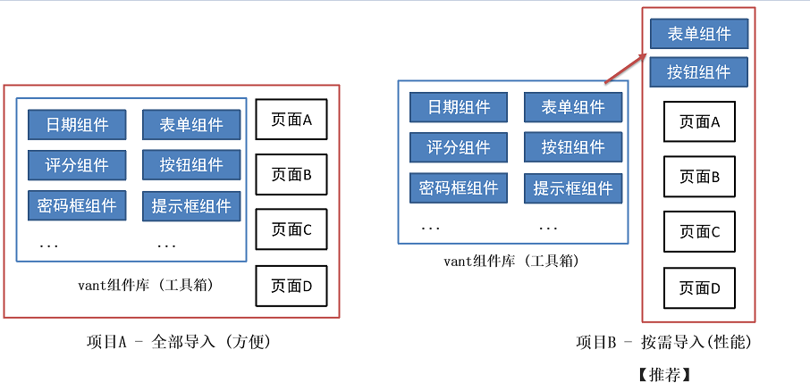
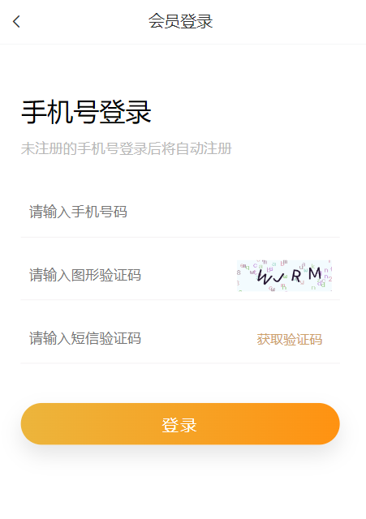
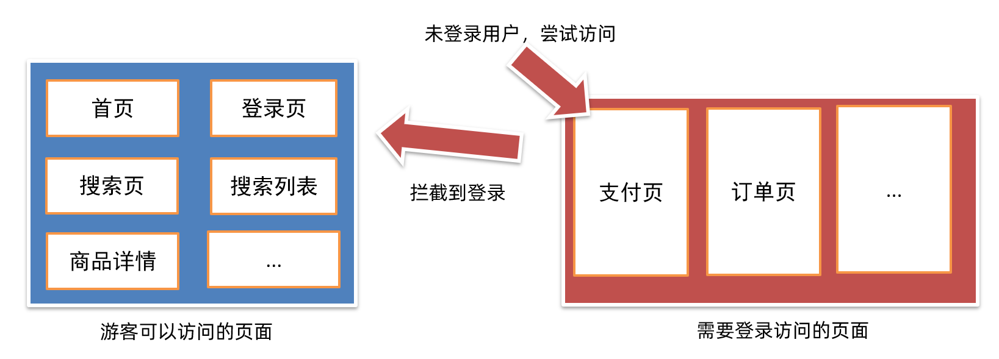
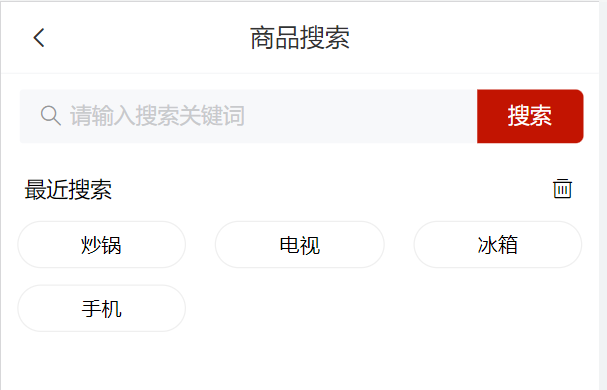
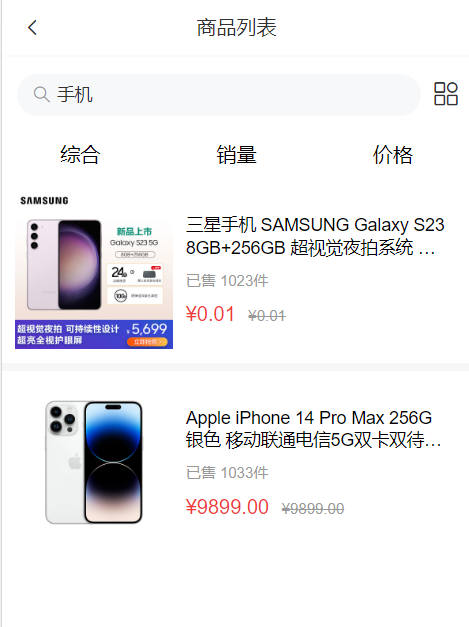
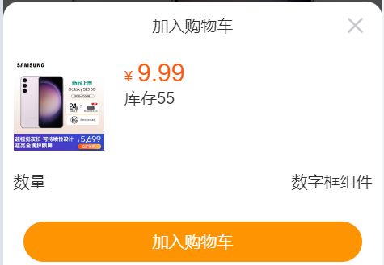
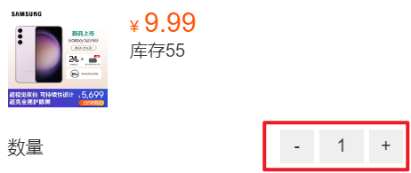
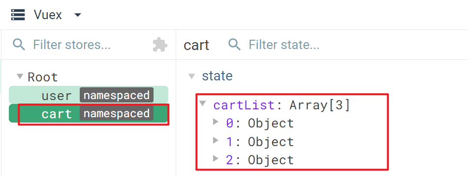
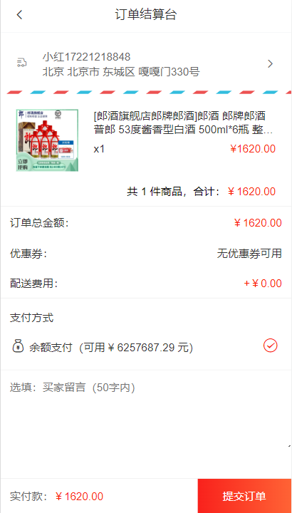

#  智慧商城 - 授课大纲

接口文档：https://apifox.com/apidoc/shared-12ab6b18-adc2-444c-ad11-0e60f5693f66/doc-2221080

演示地址：http://cba.itlike.com/public/mweb/#/

## 01. 项目功能演示

### 1.明确功能模块

启动准备好的代码，演示移动端面经内容，明确功能模块


### 2.项目收获


## 02. 项目创建目录初始化

### vue-cli 建项目 

1.安装脚手架 (已安装)

```
npm i @vue/cli -g
```

2.创建项目

```
vue create hm-shopping
```

+ 选项

```js
Vue CLI v5.0.8
? Please pick a preset:
  Default ([Vue 3] babel, eslint)
  Default ([Vue 2] babel, eslint)
> Manually select features     选自定义
```

+ 手动选择功能


+ 选择vue的版本

```jsx
  3.x
> 2.x
```

+ 是否使用history模式


+ 选择css预处理


+ 选择eslint的风格 （eslint 代码规范的检验工具，检验代码是否符合规范）
+ 比如：const age = 18;   =>  报错！多加了分号！后面有工具，一保存，全部格式化成最规范的样子


+ 选择校验的时机 （直接回车）


+ 选择配置文件的生成方式 （直接回车）


- 是否保存预设，下次直接使用？  =>   不保存，输入 N


+ 等待安装，项目初始化完成


+ 启动项目

```
npm run serve
```


## 03. 调整初始化目录结构

> 强烈建议大家严格按照老师的步骤进行调整，为了符合企业规范

为了更好的实现后面的操作，我们把整体的目录结构做一些调整。

目标:

1. 删除初始化的一些默认文件
2. 修改没删除的文件
3. 新增我们需要的目录结构

### 1.删除文件

- src/assets/logo.png
- src/components/HelloWorld.vue
- src/views/AboutView.vue
- src/views/HomeView.vue

### 2.修改文件

`main.js` 不需要修改

`router/index.js`

删除默认的路由配置

```js
import Vue from 'vue'
import VueRouter from 'vue-router'

Vue.use(VueRouter)

const routes = [
]

const router = new VueRouter({
  routes
})

export default router

```

`App.vue`

```html
<template>
  <div id="app">
    <router-view/>
  </div>
</template>
```

### 3.新增目录

- src/api 目录
  - 存储接口模块 (发送ajax请求接口的模块)
- src/utils 目录
  - 存储一些工具模块 (自己封装的方法)

目录效果如下:


## 04. vant组件库及Vue周边的其他组件库

> 组件库：第三方封装好了很多很多的组件，整合到一起就是一个组件库。
>
> https://vant-contrib.gitee.io/vant/v2/#/zh-CN/


比如日历组件、键盘组件、打分组件、下拉筛选组件等

组件库并不是唯一的，常用的组件库还有以下几种：

pc:  [element-ui](https://element.eleme.cn/#/zh-CN)    [element-plus](https://element-plus.gitee.io/zh-CN/)  [iview](https://iview.github.io/)      **[ant-design](https://antdv.com/components/overview-cn)**

移动：[vant-ui](https://vant-contrib.gitee.io/vant/v2/#/zh-CN/)     [Mint UI](http://mint-ui.github.io/docs/#/zh-cn2) (饿了么)    [Cube UI](https://didi.github.io/cube-ui/#/zh-CN/) (滴滴)


## 05. 全部导入和按需导入的区别

目标：明确 **全部导入** 和 **按需导入** 的区别



区别：

1.全部导入会引起项目打包后的体积变大，进而影响用户访问网站的性能

2.按需导入只会导入你使用的组件，进而节约了资源


## 06. 全部导入

+ 安装vant-ui

```
yarn add vant@latest-v2
```

+ 在main.js中

```js
import Vant from 'vant';
import 'vant/lib/index.css';
// 把vant中所有的组件都导入了
Vue.use(Vant)
```

- 即可使用

```jsx
<van-button type="primary">主要按钮</van-button>
<van-button type="info">信息按钮</van-button>
```


vant-ui提供了很多的组件，全部导入，会导致项目打包变得很大。


## 07. 按需导入

+ 安装vant-ui

```
yarn add vant@latest-v2
```

+ 安装一个插件

```jsd
yarn add babel-plugin-import -D
```

+ 在`babel.config.js`中配置

```js
module.exports = {
  presets: [
    '@vue/cli-plugin-babel/preset'
  ],
  plugins: [
    ['import', {
      libraryName: 'vant',
      libraryDirectory: 'es',
      style: true
    }, 'vant']
  ]
}
```

+ 按需加载，在`main.js`

```js
import { Button, Icon } from 'vant'

Vue.use(Button)
Vue.use(Icon)
```

+ `app.vue`中进行测试

```js
<van-button type="primary">主要按钮</van-button>
<van-button type="info">信息按钮</van-button>
<van-button type="default">默认按钮</van-button>
<van-button type="warning">警告按钮</van-button>
<van-button type="danger">危险按钮</van-button>
```

+ 把引入组件的步骤抽离到单独的js文件中比如 `utils/vant-ui.js`

```js
import { Button, Icon } from 'vant'

Vue.use(Button)
Vue.use(Icon)
```

main.js中进行导入

```js
// 导入按需导入的配置文件
import '@/utils/vant-ui'
```


## 08. 项目中的vw适配

官方说明：https://vant-contrib.gitee.io/vant/v2/#/zh-CN/advanced-usage

```js
yarn add postcss-px-to-viewport@1.1.1 -D
```

+ 项目根目录， 新建postcss的配置文件`postcss.config.js`

```jsx
// postcss.config.js
module.exports = {
  plugins: {
    'postcss-px-to-viewport': {
      viewportWidth: 375,
    },
  },
};
```

viewportWidth:设计稿的视口宽度

1. vant-ui中的组件就是按照375的视口宽度设计的
2. 恰好面经项目中的设计稿也是按照375的视口宽度设计的，所以此时 我们只需要配置375就可以了
3. 如果设计稿不是按照375而是按照750的宽度设计，[那此时这个值该怎么填呢？](https://zhuanlan.zhihu.com/p/366664788)


## 09. 路由配置 - 一级路由

**但凡是单个页面，独立展示的，都是一级路由**

路由设计：

- 登录页
- 首页架子
  - 首页 - 二级
  - 分类页 - 二级
  - 购物车 - 二级
  - 我的 - 二级
- 搜索页
- 搜索列表页
- 商品详情页
- 结算支付页
- 我的订单页

`router/index.js` 配置一级路由，新建对应的页面文件

```jsx
import Vue from 'vue'
import VueRouter from 'vue-router'
import Layout from '@/views/layout'
import Search from '@/views/search'
import SearchList from '@/views/search/list'
import ProDetail from '@/views/prodetail'
import Login from '@/views/login'
import Pay from '@/views/pay'
import MyOrder from '@/views/myorder'

Vue.use(VueRouter)

const router = new VueRouter({
  routes: [
    {
      path: '/login',
      component: Login
    },
    {
      path: '/',
      component: Layout
    },
    {
      path: '/search',
      component: Search
    },
    {
      path: '/searchlist',
      component: SearchList
    },
    {
      path: '/prodetail/:id',
      component: ProDetail
    },
    {
      path: '/pay',
      component: Pay
    },
    {
      path: '/myorder',
      component: MyOrder
    }
  ]
})

export default router
```


## 10. 路由配置-tabbar标签页


https://vant-contrib.gitee.io/vant/v2/#/zh-CN/tabbar

`vant-ui.js` 引入组件

```jsx
import { Tabbar, TabbarItem } from 'vant'
Vue.use(Tabbar)
Vue.use(TabbarItem)
```

`layout.vue`

1. 复制官方代码
2. 修改显示文本及显示的图标
2. 配置高亮颜色

```jsx
<template>
  <div>
    <!-- 二级路由出口 -->
    <van-tabbar active-color="#ee0a24" inactive-color="#000">
      <van-tabbar-item icon="wap-home-o">首页</van-tabbar-item>
      <van-tabbar-item icon="apps-o">分类页</van-tabbar-item>
      <van-tabbar-item icon="shopping-cart-o">购物车</van-tabbar-item>
      <van-tabbar-item icon="user-o">我的</van-tabbar-item>
    </van-tabbar>
  </div>
</template>
```


## 11. 路由配置 - 二级路由

1. `router/index.js`配置二级路由

```jsx
import Vue from 'vue'
import VueRouter from 'vue-router'
import Layout from '@/views/layout'
import Search from '@/views/search'
import SearchList from '@/views/search/list'
import ProDetail from '@/views/prodetail'
import Login from '@/views/login'
import Pay from '@/views/pay'
import MyOrder from '@/views/myorder'

import Home from '@/views/layout/home'
import Category from '@/views/layout/category'
import Cart from '@/views/layout/cart'
import User from '@/views/layout/user'

Vue.use(VueRouter)

const router = new VueRouter({
  routes: [
    {
      path: '/login',
      component: Login
    },
    {
      path: '/',
      component: Layout,
      redirect: '/home',
      children: [
        {
          path: 'home',
          component: Home
        },
        {
          path: 'category',
          component: Category
        },
        {
          path: 'cart',
          component: Cart
        },
        {
          path: 'user',
          component: User
        }
      ]
    },
    {
      path: '/search',
      component: Search
    },
    {
      path: '/searchlist',
      component: SearchList
    },
    {
      path: '/prodetail/:id',
      component: ProDetail
    },
    {
      path: '/pay',
      component: Pay
    },
    {
      path: '/myorder',
      component: MyOrder
    }
  ]
})

export default router
```

2. 准备对应的组件文件
   - `layout/home.vue`
   - `layout/category.vue`
   - `layout/cart.vue`
   - `layout/user.vue`

3. `layout.vue` 配置路由出口,  配置 tabbar

```jsx
<template>
  <div>
    <router-view></router-view>
    <van-tabbar route active-color="#ee0a24" inactive-color="#000">
      <van-tabbar-item to="/home" icon="wap-home-o">首页</van-tabbar-item>
      <van-tabbar-item to="/category" icon="apps-o">分类页</van-tabbar-item>
      <van-tabbar-item to="/cart" icon="shopping-cart-o">购物车</van-tabbar-item>
      <van-tabbar-item to="/user" icon="user-o">我的</van-tabbar-item>
    </van-tabbar>
  </div>
</template>
```


## 12. 登录页静态布局

### (1) 准备工作

1. 新建  `styles/common.less` 重置默认样式

```jsx
// 重置默认样式
* {
  margin: 0;
  padding: 0;
  box-sizing: border-box;
}

// 文字溢出省略号
.text-ellipsis-2 {
  overflow: hidden;
  -webkit-line-clamp: 2;
  text-overflow: ellipsis;
  display: -webkit-box;
  -webkit-box-orient: vertical;
}
```

2. main.js 中导入应用

```jsx
import '@/styles/common.less'
```

3. 将准备好的一些图片素材拷贝到 assets 目录【备用】


### (2) 登录静态布局



使用组件

- van-nav-bar

`vant-ui.js` 注册

```jsx
import { NavBar } from 'vant'
Vue.use(NavBar)
```

`Login.vue` 使用

```jsx
<template>
  <div class="login">
    <van-nav-bar title="会员登录" left-arrow @click-left="$router.go(-1)" />
    <div class="container">
      <div class="title">
        <h3>手机号登录</h3>
        <p>未注册的手机号登录后将自动注册</p>
      </div>

      <div class="form">
        <div class="form-item">
          <input class="inp" maxlength="11" placeholder="请输入手机号码" type="text">
        </div>
        <div class="form-item">
          <input class="inp" maxlength="5" placeholder="请输入图形验证码" type="text">
          
        </div>
        <div class="form-item">
          <input class="inp" placeholder="请输入短信验证码" type="text">
          <button>获取验证码</button>
        </div>
      </div>

      <div class="login-btn">登录</div>
    </div>
  </div>
</template>

<script>
export default {
  name: 'LoginPage'
}
</script>

<style lang="less" scoped>
.container {
  padding: 49px 29px;

  .title {
    margin-bottom: 20px;
    h3 {
      font-size: 26px;
      font-weight: normal;
    }
    p {
      line-height: 40px;
      font-size: 14px;
      color: #b8b8b8;
    }
  }

  .form-item {
    border-bottom: 1px solid #f3f1f2;
    padding: 8px;
    margin-bottom: 14px;
    display: flex;
    align-items: center;
    .inp {
      display: block;
      border: none;
      outline: none;
      height: 32px;
      font-size: 14px;
      flex: 1;
    }
    img {
      width: 94px;
      height: 31px;
    }
    button {
      height: 31px;
      border: none;
      font-size: 13px;
      color: #cea26a;
      background-color: transparent;
      padding-right: 9px;
    }
  }

  .login-btn {
    width: 100%;
    height: 42px;
    margin-top: 39px;
    background: linear-gradient(90deg,#ecb53c,#ff9211);
    color: #fff;
    border-radius: 39px;
    box-shadow: 0 10px 20px 0 rgba(0,0,0,.1);
    letter-spacing: 2px;
    display: flex;
    justify-content: center;
    align-items: center;
  }
}
</style>
```

**添加通用样式**

`styles/common.less` 设置导航条，返回箭头颜色

```jsx
// 设置导航条 返回箭头 颜色
.van-nav-bar {
  .van-icon-arrow-left {
    color: #333;
  }
}
```


## 13. request模块 - axios封装

接口文档：https://apifox.com/apidoc/shared-12ab6b18-adc2-444c-ad11-0e60f5693f66/doc-2221080

演示地址：http://cba.itlike.com/public/mweb/#/

基地址：http://cba.itlike.com/public/index.php?s=/api/

我们会使用 axios 来请求**后端接口**, 一般都会对 axios 进行**一些配置** (比如: 配置基础地址,请求响应拦截器等等)

一般项目开发中, 都会对 axios 进行基本的**二次封装**, 单独封装到一个模块中, 便于使用


**目标：将 axios 请求方法，封装到 request 模块**

1. 安装 axios

```
npm i axios
```

2. 新建 `utils/request.js` 封装 axios 模块

   利用 axios.create 创建一个自定义的 axios 来使用

   http://www.axios-js.com/zh-cn/docs/#axios-create-config

```js
/* 封装axios用于发送请求 */
import axios from 'axios'

// 创建一个新的axios实例
const request = axios.create({
  baseURL: 'http://cba.itlike.com/public/index.php?s=/api/',
  timeout: 5000
})

// 添加请求拦截器
request.interceptors.request.use(function (config) {
  // 在发送请求之前做些什么
  return config
}, function (error) {
  // 对请求错误做些什么
  return Promise.reject(error)
})

// 添加响应拦截器
request.interceptors.response.use(function (response) {
  // 对响应数据做点什么
  return response.data
}, function (error) {
  // 对响应错误做点什么
  return Promise.reject(error)
})

export default request
```

3. 获取图形验证码，请求测试

```js
import request from '@/utils/request'
export default {
  name: 'LoginPage',
  async created () {
    const res = await request.get('/captcha/image')
    console.log(res)
  }
}
```


## 14. 图形验证码功能完成


1. 准备数据，获取图形验证码后存储图片路径，存储图片唯一标识

```jsx
async created () {
  this.getPicCode()
},
data () {
  return {
    picUrl: '',
    picKey: ''
  }
},
methods: {
  // 获取图形验证码
  async getPicCode () {
    const { data: { base64, key } } = await request.get('/captcha/image')
    this.picUrl = base64
    this.picKey = key
  }
}
```

2. 动态渲染图形验证码，并且点击时要重新刷新验证码

```jsx

```


## 15. 封装api接口 - 图片验证码接口

**1.目标：**将请求封装成方法，统一存放到 api 模块，与页面分离

**2.原因：以前的模式**


- 页面中充斥着请求代码

- 可阅读性不高

- **相同的请求没有复用请求没有统一管理**

  

**3.期望：**


- 请求与页面逻辑分离
- 相同的请求可以直接复用请求
- 进行了统一管理


**4.具体实现**

新建 `api/login.js` 提供获取图形验证码 Api 函数

```jsx
import request from '@/utils/request'

// 获取图形验证码
export const getPicCode = () => {
  return request.get('/captcha/image')
}
```

`login/index.vue`页面中调用测试

```jsx
async getPicCode () {
  const { data: { base64, key } } = await getPicCode()
  this.picUrl = base64
  this.picKey = key
},
```


## 16. toast 轻提示

https://vant-contrib.gitee.io/vant/v2/#/zh-CN/toast

两种使用方式

1. 导入调用 ( **组件内** 或 **非组件中均可** ) 

```jsx
import { Toast } from 'vant';
Toast('提示内容');
```

2. 通过this直接调用 ( **组件内 **)

main.js 注册绑定到原型

```js
import { Toast } from 'vant';
Vue.use(Toast)
```

```jsx
this.$toast('提示内容')
```


## 17. 短信验证倒计时功能


### (1) 倒计时基础效果

1. 准备 data 数据

```jsx
data () {
  return {
    totalSecond: 60, // 总秒数
    second: 60, // 倒计时的秒数
    timer: null // 定时器 id
  }
},
```

2. 给按钮注册点击事件

```jsx
<button @click="getCode">
  {{ second === totalSecond ? '获取验证码' : second + `秒后重新发送`}}
</button>
```

3. 开启倒计时时

```jsx
async getCode () {
  if (!this.timer && this.second === this.totalSecond) {
    // 开启倒计时
    this.timer = setInterval(() => {
      this.second--

      if (this.second < 1) {
        clearInterval(this.timer)
        this.timer = null
        this.second = this.totalSecond
      }
    }, 1000)

    // 发送请求，获取验证码
    this.$toast('发送成功，请注意查收')
  }
}
```

4. 离开页面销毁定时器

```jsx
destroyed () {
  clearInterval(this.timer)
}
```


### (2) 验证码请求校验处理

1. 输入框 v-model 绑定变量

```jsx
data () {
  return {
    mobile: '', // 手机号
    picCode: '' // 图形验证码
  }
},
    
<input v-model="mobile" class="inp" maxlength="11" placeholder="请输入手机号码" type="text">
<input v-model="picCode" class="inp" maxlength="5" placeholder="请输入图形验证码" type="text">
```

2. methods中封装校验方法

```jsx
// 校验输入框内容
validFn () {
  if (!/^1[3-9]\d{9}$/.test(this.mobile)) {
    this.$toast('请输入正确的手机号')
    return false
  }
  if (!/^\w{4}$/.test(this.picCode)) {
    this.$toast('请输入正确的图形验证码')
    return false
  }
  return true
},
```

3. 请求倒计时前进行校验

```jsx
// 获取短信验证码
async getCode () {
  if (!this.validFn()) {
    return
  }
  ...
}
```


### (3) 封装接口，请求获取验证码

1. 封装接口 `api/login.js`

```jsx
// 获取短信验证码
export const getMsgCode = (captchaCode, captchaKey, mobile) => {
  return request.post('/captcha/sendSmsCaptcha', {
    form: {
      captchaCode,
      captchaKey,
      mobile
    }
  })
}
```

2. 调用接口，添加提示

```jsx
// 获取短信验证码
async getCode () {
  if (!this.validFn()) {
    return
  }

  if (!this.timer && this.second === this.totalSecond) {
    // 发送请求，获取验证码
    await getMsgCode(this.picCode, this.picKey, this.mobile)
    this.$toast('发送成功，请注意查收')
    
    // 开启倒计时
    ...
  }
}
```


## 18. 封装api接口 - 登录功能

`api/login.js` 提供登录 Api 函数

```jsx
// 验证码登录
export const codeLogin = (mobile, smsCode) => {
  return request.post('/passport/login', {
    form: {
      isParty: false,
      mobile,
      partyData: {},
      smsCode
    }
  })
}
```

`login/index.vue` 登录功能

```jsx
<input class="inp" v-model="msgCode" maxlength="6" placeholder="请输入短信验证码" type="text">
<div class="login-btn" @click="login">登录</div>

data () {
  return {
    msgCode: '',
  }
},
methods: {
  async login () {
    if (!this.validFn()) {
      return
    }
    if (!/^\d{6}$/.test(this.msgCode)) {
      this.$toast('请输入正确的手机验证码')
      return
    }
    await codeLogin(this.mobile, this.msgCode)
    this.$router.push('/')
    this.$toast('登录成功')
  }
}
```


## 19. 响应拦截器统一处理错误提示

响应拦截器是咱们拿到数据的 **第一个** “数据流转站”，可以在里面统一处理错误，只要不是 200 默认给提示，抛出错误

`utils/request.js`

```jsx
import { Toast } from 'vant'

...

// 添加响应拦截器
request.interceptors.response.use(function (response) {
  const res = response.data
  if (res.status !== 200) {
    Toast(res.message)
    return Promise.reject(res.message)
  }
  // 对响应数据做点什么
  return res
}, function (error) {
  // 对响应错误做点什么
  return Promise.reject(error)
})
```


## 20. 将登录权证信息存入 vuex

1. 新建 vuex user 模块  store/modules/user.js

```jsx
export default {
  namespaced: true,
  state () {
    return {
      userInfo: {
        token: '',
        userId: ''
      },
    }
  },
  mutations: {},
  actions: {}
}
```

2. 挂载到 vuex 上

```jsx
import Vue from 'vue'
import Vuex from 'vuex'
import user from './modules/user'

Vue.use(Vuex)

export default new Vuex.Store({
  modules: {
    user,
  }
})
```

3. 提供 mutations

```jsx
mutations: {
  setUserInfo (state, obj) {
    state.userInfo = obj
  },
},
```

4. 页面中 commit 调用

```jsx
// 登录按钮（校验 & 提交）
async login () {
  if (!this.validFn()) {
    return
  }
  ...
  const res = await codeLogin(this.mobile, this.msgCode)
  this.$store.commit('user/setUserInfo', res.data)
  this.$router.push('/')
  this.$toast('登录成功')
}
```


## 21. vuex持久化处理

1. 新建 `utils/storage.js` 封装方法

```jsx
const INFO_KEY = 'hm_shopping_info'

// 获取个人信息
export const getInfo = () => {
  const result = localStorage.getItem(INFO_KEY)
  return result ? JSON.parse(result) : {
    token: '',
    userId: ''
  }
}

// 设置个人信息
export const setInfo = (info) => {
  localStorage.setItem(INFO_KEY, JSON.stringify(info))
}

// 移除个人信息
export const removeInfo = () => {
  localStorage.removeItem(INFO_KEY)
}
```

2. vuex user 模块持久化处理

```jsx
import { getInfo, setInfo } from '@/utils/storage'
export default {
  namespaced: true,
  state () {
    return {
      userInfo: getInfo()
    }
  },
  mutations: {
    setUserInfo (state, obj) {
      state.userInfo = obj
      setInfo(obj)
    }
  },
  actions: {}
}
```


## 22. 优化：添加请求 loading 效果

1. 请求时，打开 loading

```jsx
// 添加请求拦截器
request.interceptors.request.use(function (config) {
  // 在发送请求之前做些什么
  Toast.loading({
    message: '请求中...',
    forbidClick: true,
    loadingType: 'spinner',
    duration: 0
  })
  return config
}, function (error) {
  // 对请求错误做些什么
  return Promise.reject(error)
})
```

2. 响应时，关闭 loading

```jsx
// 添加响应拦截器
request.interceptors.response.use(function (response) {
  const res = response.data
  if (res.status !== 200) {
    Toast(res.message)
    return Promise.reject(res.message)
  } else {
    // 清除 loading 中的效果
    Toast.clear()
  }
  // 对响应数据做点什么
  return res
}, function (error) {
  // 对响应错误做点什么
  return Promise.reject(error)
})
```


## 23. 登录访问拦截 - 路由前置守卫

**目标：基于全局前置守卫，进行页面访问拦截处理**

说明：智慧商城项目，大部分页面，游客都可以直接访问, 如遇到需要登录才能进行的操作，提示并跳转到登录

但是：对于支付页，订单页等，必须是登录的用户才能访问的，游客不能进入该页面，需要做拦截处理



路由导航守卫 - [全局前置守卫](https://v3.router.vuejs.org/zh/guide/advanced/navigation-guards.html)

1.所有的路由一旦被匹配到，都会先经过全局前置守卫

2.只有全局前置守卫放行，才会真正解析渲染组件，才能看到页面内容

```jsx
router.beforeEach((to, from, next) => {
  // 1. to   往哪里去， 到哪去的路由信息对象  
  // 2. from 从哪里来， 从哪来的路由信息对象
  // 3. next() 是否放行
  //    如果next()调用，就是放行
  //    next(路径) 拦截到某个路径页面
})
```


```jsx
const authUrl = ['/pay', '/myorder']
router.beforeEach((to, from, next) => {
  const token = store.getters.token
  if (!authUrl.includes(to.path)) {
    next()
    return
  }

  if (token) {
    next()
  } else {
    next('/login')
  }
})
```


## 24. 首页 - 静态结构准备


1. 静态结构和样式 `layout/home.vue`

```jsx
<template>
  <div class="home">
    <!-- 导航条 -->
    <van-nav-bar title="智慧商城" fixed />

    <!-- 搜索框 -->
    <van-search
      readonly
      shape="round"
      background="#f1f1f2"
      placeholder="请在此输入搜索关键词"
      @click="$router.push('/search')"
    />

    <!-- 轮播图 -->
    <van-swipe class="my-swipe" :autoplay="3000" indicator-color="white">
      <van-swipe-item>
        
      </van-swipe-item>
      <van-swipe-item>
        
      </van-swipe-item>
      <van-swipe-item>
        
      </van-swipe-item>
    </van-swipe>

    <!-- 导航 -->
    <van-grid column-num="5" icon-size="40">
      <van-grid-item
        v-for="item in 10" :key="item"
        icon="http://cba.itlike.com/public/uploads/10001/20230320/58a7c1f62df4cb1eb47fe83ff0e566e6.png"
        text="新品首发"
        @click="$router.push('/category')"
      />
    </van-grid>

    <!-- 主会场 -->
    <div class="main">
      
    </div>

    <!-- 猜你喜欢 -->
    <div class="guess">
      <p class="guess-title">—— 猜你喜欢 ——</p>

      <div class="goods-list">
        <GoodsItem v-for="item in 10" :key="item"></GoodsItem>
      </div>
    </div>
  </div>
</template>

<script>
import GoodsItem from '@/components/GoodsItem.vue'
export default {
  name: 'HomePage',
  components: {
    GoodsItem
  }
}
</script>

<style lang="less" scoped>
// 主题 padding
.home {
  padding-top: 100px;
  padding-bottom: 50px;
}

// 导航条样式定制
.van-nav-bar {
  z-index: 999;
  background-color: #c21401;
  ::v-deep .van-nav-bar__title {
    color: #fff;
  }
}

// 搜索框样式定制
.van-search {
  position: fixed;
  width: 100%;
  top: 46px;
  z-index: 999;
}

// 分类导航部分
.my-swipe .van-swipe-item {
  height: 185px;
  color: #fff;
  font-size: 20px;
  text-align: center;
  background-color: #39a9ed;
}
.my-swipe .van-swipe-item img {
  width: 100%;
  height: 185px;
}

// 主会场
.main img {
  display: block;
  width: 100%;
}

// 猜你喜欢
.guess .guess-title {
  height: 40px;
  line-height: 40px;
  text-align: center;
}

// 商品样式
.goods-list {
  background-color: #f6f6f6;
}
</style>
```

2. 新建`components/GoodsItem.vue`

```jsx
<template>
  <div class="goods-item" @click="$router.push('/prodetail')">
    <div class="left">
      
    </div>
    <div class="right">
      <p class="tit text-ellipsis-2">
        三星手机 SAMSUNG Galaxy S23 8GB+256GB 超视觉夜拍系统 超清夜景 悠雾紫
        5G手机 游戏拍照旗舰机s23
      </p>
      <p class="count">已售104件</p>
      <p class="price">
        <span class="new">¥3999.00</span>
        <span class="old">¥6699.00</span>
      </p>
    </div>
  </div>
</template>

<script>
export default {
        name:'GoodsItem'
    }
</script>

<style lang="less" scoped>
.goods-item {
  height: 148px;
  margin-bottom: 6px;
  padding: 10px;
  background-color: #fff;
  display: flex;
  .left {
    width: 127px;
    img {
      display: block;
      width: 100%;
    }
  }
  .right {
    flex: 1;
    font-size: 14px;
    line-height: 1.3;
    padding: 10px;
    display: flex;
    flex-direction: column;
    justify-content: space-evenly;

    .count {
      color: #999;
      font-size: 12px;
    }
    .price {
      color: #999;
      font-size: 16px;
      .new {
        color: #f03c3c;
        margin-right: 10px;
      }
      .old {
        text-decoration: line-through;
        font-size: 12px;
      }
    }
  }
}
</style>

```

3. 组件按需引入

```jsx
import { Search, Swipe, SwipeItem, Grid, GridItem } from 'vant'

Vue.use(GridItem)
Vue.use(Search)
Vue.use(Swipe)
Vue.use(SwipeItem)
Vue.use(Grid)
```


## 25. 首页 - 动态渲染

1. 封装准备接口 `api/home.js`

```jsx
import request from '@/utils/request'

// 获取首页数据
export const getHomeData = () => {
  return request.get('/page/detail', {
    params: {
      pageId: 0
    }
  })
}
```

2. 页面中请求调用

```jsx
import GoodsItem from '@/components/GoodsItem.vue'
import { getHomeData } from '@/api/home'
export default {
  name: 'HomePage',
  components: {
    GoodsItem
  },
  data () {
    return {
      bannerList: [],
      navList: [],
      proList: []
    }
  },
  async created () {
    const { data: { pageData } } = await getHomeData()
    this.bannerList = pageData.items[1].data
    this.navList = pageData.items[3].data
    this.proList = pageData.items[6].data
  }
}
```

3. 轮播图、导航、猜你喜欢渲染

```jsx
<!-- 轮播图 -->
<van-swipe class="my-swipe" :autoplay="3000" indicator-color="white">
  <van-swipe-item v-for="item in bannerList" :key="item.imgUrl">
    
  </van-swipe-item>
</van-swipe>

<!-- 导航 -->
<van-grid column-num="5" icon-size="40">
  <van-grid-item
    v-for="item in navList" :key="item.imgUrl"
    :icon="item.imgUrl"
    :text="item.text"
    @click="$router.push('/category')"
  />
</van-grid>
    
<!-- 猜你喜欢 -->
<div class="guess">
  <p class="guess-title">—— 猜你喜欢 ——</p>

  <div class="goods-list">
    <GoodsItem v-for="item in proList"  :item="item" :key="item.goods_id"></GoodsItem>
  </div>
</div>
```

4. 商品组件内，动态渲染

```jsx
<template>
  <div v-if="item.goods_name" class="goods-item" @click="$router.push(`/prodetail/${item.goods_id}`)">
    <div class="left">
      
    </div>
    <div class="right">
      <p class="tit text-ellipsis-2">
        {{ item.goods_name }}
      </p>
      <p class="count">已售 {{ item.goods_sales }}件</p>
      <p class="price">
        <span class="new">¥{{ item.goods_price_min }}</span>
        <span class="old">¥{{ item.goods_price_max }}</span>
      </p>
    </div>
  </div>
</template>

<script>
export default {
  props: {
    item: {
      type: Object,
      default: () => {
        return {}
      }
    }
  }
}
</script>
```


## 26. 搜索 - 静态布局准备



1. 静态结构和代码

```jsx
<template>
  <div class="search">
    <van-nav-bar title="商品搜索" left-arrow @click-left="$router.go(-1)" />

    <van-search show-action placeholder="请输入搜索关键词" clearable>
      <template #action>
        <div>搜索</div>
      </template>
    </van-search>

    <!-- 搜索历史 -->
    <div class="search-history">
      <div class="title">
        <span>最近搜索</span>
        <van-icon name="delete-o" size="16" />
      </div>
      <div class="list">
        <div class="list-item" @click="$router.push('/searchlist')">炒锅</div>
        <div class="list-item" @click="$router.push('/searchlist')">电视</div>
        <div class="list-item" @click="$router.push('/searchlist')">冰箱</div>
        <div class="list-item" @click="$router.push('/searchlist')">手机</div>
      </div>
    </div>
  </div>
</template>

<script>
export default {
  name: 'SearchIndex'
}
</script>

<style lang="less" scoped>
.search {
  .searchBtn {
    background-color: #fa2209;
    color: #fff;
  }
  ::v-deep .van-search__action {
    background-color: #c21401;
    color: #fff;
    padding: 0 20px;
    border-radius: 0 5px 5px 0;
    margin-right: 10px;
  }
  ::v-deep .van-icon-arrow-left {
    color: #333;
  }
  .title {
    height: 40px;
    line-height: 40px;
    font-size: 14px;
    display: flex;
    justify-content: space-between;
    align-items: center;
    padding: 0 15px;
  }
  .list {
    display: flex;
    justify-content: flex-start;
    flex-wrap: wrap;
    padding: 0 10px;
    gap: 5%;
  }
  .list-item {
    width: 30%;
    text-align: center;
    padding: 7px;
    line-height: 15px;
    border-radius: 50px;
    background: #fff;
    font-size: 13px;
    border: 1px solid #efefef;
    overflow: hidden;
    white-space: nowrap;
    text-overflow: ellipsis;
    margin-bottom: 10px;
  }
}
</style>
```

2. 组件按需导入

```jsx
import { Icon } from 'vant'
Vue.use(Icon)
```


## 27. 搜索 - 历史记录 - 基本管理

1. data 中提供数据，和搜索框双向绑定 (实时获取用户内容)

```jsx
data () {
  return {
    search: ''
  }
}

<van-search v-model="search" show-action placeholder="请输入搜索关键词" clearable>
  <template #action>
    <div>搜索</div>
  </template>
</van-search>
```

2. 准备假数据，进行基本的历史纪录渲染

```jsx
data () {
  return {
    ...
    history: ['手机', '空调', '白酒', '电视']
  }
},
    
<div class="search-history" v-if="history.length > 0">
  ...
  <div class="list">
    <div v-for="item in history" :key="item" @click="goSearch(item)" class="list-item">
      {{ item }}
    </div>
  </div>
</div>
```

3. 点击搜索，或者下面搜索历史按钮，都要进行搜索历史记录更新 (去重，新搜索的内容置顶)

```jsx
<div @click="goSearch(search)">搜索</div>

<div class="list">
  <div v-for="item in history" :key="item" @click="goSearch(item)" class="list-item">
    {{ item }}
  </div>
</div>

goSearch (key) {
  const index = this.history.indexOf(key)
  if (index !== -1) {
    this.history.splice(index, 1)
  }
  this.history.unshift(key)
  this.$router.push(`/searchlist?search=${key}`)
}
```

4. 清空历史

```jsx
<van-icon @click="clear" name="delete-o" size="16" />

clear () {
  this.history = []
}
```


## 28. 搜索 - 历史记录 - 持久化

1. 持久化到本地 - 封装方法

```jsx
const HISTORY_KEY = 'hm_history_list'

// 获取搜索历史
export const getHistoryList = () => {
  const result = localStorage.getItem(HISTORY_KEY)
  return result ? JSON.parse(result) : []
}

// 设置搜索历史
export const setHistoryList = (arr) => {
  localStorage.setItem(HISTORY_KEY, JSON.stringify(arr))
}
```

2. 页面中调用 - 实现持久化

```jsx
import { getHistoryList,setHistoryList } from '@/utils/storage'
data () {
  return {
    search: '',
    history: getHistoryList()
  }
},
methods: {
  goSearch (key) {
    ...
    setHistoryList(this.history)
    this.$router.push(`/searchlist?search=${key}`)
  },
  clear () {
    this.history = []
    setHistoryList([])
    this.$toast.success('清空历史成功')
  }
}
```


## 29. 搜索列表 - 静态布局





```jsx
<template>
  <div class="search">
    <van-nav-bar fixed title="商品列表" left-arrow @click-left="$router.go(-1)" />

    <van-search
      readonly
      shape="round"
      background="#ffffff"
      value="手机"
      show-action
      @click="$router.push('/search')"
    >
      <template #action>
        <van-icon class="tool" name="apps-o" />
      </template>
    </van-search>

    <!-- 排序选项按钮 -->
    <div class="sort-btns">
      <div class="sort-item">综合</div>
      <div class="sort-item">销量</div>
      <div class="sort-item">价格 </div>
    </div>

    <div class="goods-list">
      <GoodsItem v-for="item in 10" :key="item"></GoodsItem>
    </div>
  </div>
</template>

<script>
import GoodsItem from '@/components/GoodsItem.vue'
export default {
  name: 'SearchList',
  components: {
    GoodsItem
  }
}
</script>

<style lang="less" scoped>
.search {
  padding-top: 46px;
  ::v-deep .van-icon-arrow-left {
    color: #333;
  }
  .tool {
    font-size: 24px;
    height: 40px;
    line-height: 40px;
  }

  .sort-btns {
    display: flex;
    height: 36px;
    line-height: 36px;
    .sort-item {
      text-align: center;
      flex: 1;
      font-size: 16px;
    }
  }
}

// 商品样式
.goods-list {
  background-color: #f6f6f6;
}
</style>
```


## 30. 搜索列表 - 动态渲染

### (1) 搜索关键字搜索


1. 计算属性，基于query 解析路由参数

```jsx
computed: {
  querySearch () {
    return this.$route.query.search
  }
}
```

2. 根据不同的情况，设置输入框的值

```jsx
<van-search
  ...
  :value="querySearch || '搜索商品'"
></van-search>
```

3. `api/product.js` 封装接口，获取搜索商品

```jsx
import request from '@/utils/request'

// 获取搜索商品列表数据
export const getProList = (paramsObj) => {
  const { categoryId, goodsName, page } = paramsObj
  return request.get('/goods/list', {
    params: {
      categoryId,
      goodsName,
      page
    }
  })
}
```

4. 页面中基于 goodsName 发送请求，动态渲染

```jsx
data () {
  return {
    page: 1,
    proList: []
  }
},
async created () {
  const { data: { list } } = await getProList({
    goodsName: this.querySearch,
    page: this.page
  })
  this.proList = list.data
}

<div class="goods-list">
  <GoodsItem v-for="item in proList" :key="item.goods_id" :item="item"></GoodsItem>
</div>
```


### (2) 分类id搜索


1 封装接口 `api/category.js`

```jsx
import request from '@/utils/request'

// 获取分类数据
export const getCategoryData = () => {
  return request.get('/category/list')
}
```

2 分类页静态结构

```jsx
<template>
  <div class="category">
    <!-- 分类 -->
    <van-nav-bar title="全部分类" fixed />

    <!-- 搜索框 -->
    <van-search
      readonly
      shape="round"
      background="#f1f1f2"
      placeholder="请输入搜索关键词"
      @click="$router.push('/search')"
    />

    <!-- 分类列表 -->
    <div class="list-box">
      <div class="left">
        <ul>
          <li v-for="(item, index) in list" :key="item.category_id">
            <a :class="{ active: index === activeIndex }" @click="activeIndex = index" href="javascript:;">{{ item.name }}</a>
          </li>
        </ul>
      </div>
      <div class="right">
        <div @click="$router.push(`/searchlist?categoryId=${item.category_id}`)" v-for="item in list[activeIndex]?.children" :key="item.category_id" class="cate-goods">
          
          <p>{{ item.name }}</p>
        </div>
      </div>
    </div>
  </div>
</template>

<script>
import { getCategoryData } from '@/api/category'
export default {
  name: 'CategoryPage',
  created () {
    this.getCategoryList()
  },
  data () {
    return {
      list: [],
      activeIndex: 0
    }
  },
  methods: {
    async getCategoryList () {
      const { data: { list } } = await getCategoryData()
      this.list = list
    }
  }
}
</script>

<style lang="less" scoped>
// 主题 padding
.category {
  padding-top: 100px;
  padding-bottom: 50px;
  height: 100vh;
  .list-box {
    height: 100%;
    display: flex;
    .left {
      width: 85px;
      height: 100%;
      background-color: #f3f3f3;
      overflow: auto;
      a {
        display: block;
        height: 45px;
        line-height: 45px;
        text-align: center;
        color: #444444;
        font-size: 12px;
        &.active {
          color: #fb442f;
          background-color: #fff;
        }
      }
    }
    .right {
      flex: 1;
      height: 100%;
      background-color: #ffffff;
      display: flex;
      flex-wrap: wrap;
      justify-content: flex-start;
      align-content: flex-start;
      padding: 10px 0;
      overflow: auto;

      .cate-goods {
        width: 33.3%;
        margin-bottom: 10px;
        img {
          width: 70px;
          height: 70px;
          display: block;
          margin: 5px auto;
        }
        p {
          text-align: center;
          font-size: 12px;
        }
      }
    }
  }
}

// 导航条样式定制
.van-nav-bar {
  z-index: 999;
}

// 搜索框样式定制
.van-search {
  position: fixed;
  width: 100%;
  top: 46px;
  z-index: 999;
}
</style>
```

3 搜索页，基于分类 ID 请求

```jsx
async created () {
  const { data: { list } } = await getProList({
    categoryId: this.$route.query.categoryId,
    goodsName: this.querySearch,
    page: this.page
  })
  this.proList = list.data
}
```


## 31. 商品详情 - 静态布局


静态结构 和 样式

```jsx
<template>
  <div class="prodetail">
    <van-nav-bar fixed title="商品详情页" left-arrow @click-left="$router.go(-1)" />

    <van-swipe :autoplay="3000" @change="onChange">
      <van-swipe-item v-for="(image, index) in images" :key="index">
        
      </van-swipe-item>

      <template #indicator>
        <div class="custom-indicator">{{ current + 1 }} / {{ images.length }}</div>
      </template>
    </van-swipe>

    <!-- 商品说明 -->
    <div class="info">
      <div class="title">
        <div class="price">
          <span class="now">￥0.01</span>
          <span class="oldprice">￥6699.00</span>
        </div>
        <div class="sellcount">已售1001件</div>
      </div>
      <div class="msg text-ellipsis-2">
        三星手机 SAMSUNG Galaxy S23 8GB+256GB 超视觉夜拍系统 超清夜景 悠雾紫 5G手机 游戏拍照旗舰机s23
      </div>

      <div class="service">
        <div class="left-words">
          <span><van-icon name="passed" />七天无理由退货</span>
          <span><van-icon name="passed" />48小时发货</span>
        </div>
        <div class="right-icon">
          <van-icon name="arrow" />
        </div>
      </div>
    </div>

    <!-- 商品评价 -->
    <div class="comment">
      <div class="comment-title">
        <div class="left">商品评价 (5条)</div>
        <div class="right">查看更多 <van-icon name="arrow" /> </div>
      </div>
      <div class="comment-list">
        <div class="comment-item" v-for="item in 3" :key="item">
          <div class="top">
            
            <div class="name">神雕大侠</div>
            <van-rate :size="16" :value="5" color="#ffd21e" void-icon="star" void-color="#eee"/>
          </div>
          <div class="content">
            质量很不错 挺喜欢的
          </div>
          <div class="time">
            2023-03-21 15:01:35
          </div>
        </div>
      </div>
    </div>

    <!-- 商品描述 -->
    <div class="desc">
      
      
      
      
    </div>

    <!-- 底部 -->
    <div class="footer">
      <div class="icon-home">
        <van-icon name="wap-home-o" />
        <span>首页</span>
      </div>
      <div class="icon-cart">
        <van-icon name="shopping-cart-o" />
        <span>购物车</span>
      </div>
      <div class="btn-add">加入购物车</div>
      <div class="btn-buy">立刻购买</div>
    </div>
  </div>
</template>

<script>
export default {
  name: 'ProDetailIndex',
  data () {
    return {
      images: [
        'https://img01.yzcdn.cn/vant/apple-1.jpg',
        'https://img01.yzcdn.cn/vant/apple-2.jpg'
      ],
      current: 0
    }
  },
  methods: {
    onChange (index) {
      this.current = index
    }
  }
}
</script>

<style lang="less" scoped>
.prodetail {
  padding-top: 46px;
  ::v-deep .van-icon-arrow-left {
    color: #333;
  }
  img {
    display: block;
    width: 100%;
  }
  .custom-indicator {
    position: absolute;
    right: 10px;
    bottom: 10px;
    padding: 5px 10px;
    font-size: 12px;
    background: rgba(0, 0, 0, 0.1);
    border-radius: 15px;
  }
  .desc {
    width: 100%;
    overflow: scroll;
    ::v-deep img {
      display: block;
      width: 100%!important;
    }
  }
  .info {
    padding: 10px;
  }
  .title {
    display: flex;
    justify-content: space-between;
    .now {
      color: #fa2209;
      font-size: 20px;
    }
    .oldprice {
      color: #959595;
      font-size: 16px;
      text-decoration: line-through;
      margin-left: 5px;
    }
    .sellcount {
      color: #959595;
      font-size: 16px;
      position: relative;
      top: 4px;
    }
  }
  .msg {
    font-size: 16px;
    line-height: 24px;
    margin-top: 5px;
  }
  .service {
    display: flex;
    justify-content: space-between;
    line-height: 40px;
    margin-top: 10px;
    font-size: 16px;
    background-color: #fafafa;
    .left-words {
      span {
        margin-right: 10px;
      }
      .van-icon {
        margin-right: 4px;
        color: #fa2209;
      }
    }
  }

  .comment {
    padding: 10px;
  }
  .comment-title {
    display: flex;
    justify-content: space-between;
    .right {
      color: #959595;
    }
  }

  .comment-item {
    font-size: 16px;
    line-height: 30px;
    .top {
      height: 30px;
      display: flex;
      align-items: center;
      margin-top: 20px;
      img {
        width: 20px;
        height: 20px;
      }
      .name {
        margin: 0 10px;
      }
    }
    .time {
      color: #999;
    }
  }

  .footer {
    position: fixed;
    left: 0;
    bottom: 0;
    width: 100%;
    height: 55px;
    background-color: #fff;
    border-top: 1px solid #ccc;
    display: flex;
    justify-content: space-evenly;
    align-items: center;
    .icon-home, .icon-cart {
      display: flex;
      flex-direction: column;
      align-items: center;
      justify-content: center;
      font-size: 14px;
      .van-icon {
        font-size: 24px;
      }
    }
    .btn-add,
    .btn-buy {
      height: 36px;
      line-height: 36px;
      width: 120px;
      border-radius: 18px;
      background-color: #ffa900;
      text-align: center;
      color: #fff;
      font-size: 14px;
    }
    .btn-buy {
      background-color: #fe5630;
    }
  }
}
    
.tips {
  padding: 10px;
}
</style>
```

`Lazyload` 是 `Vue` 指令，使用前需要对指令进行注册。

```jsx
import { Lazyload } from 'vant'
Vue.use(Lazyload)
```


## 32. 商品详情 - 动态渲染介绍

1. 动态路由参数，获取商品 id

```jsx
computed: {
  goodsId () {
    return this.$route.params.id
  }
},
```

2. 封装 api 接口 `api/product.js`

```jsx
// 获取商品详情数据
export const getProDetail = (goodsId) => {
  return request.get('/goods/detail', {
    params: {
      goodsId
    }
  })
}
```

3. 一进入页面发送请求，获取商品详情数据

```jsx
data () {
  return {
    images: [
      'https://img01.yzcdn.cn/vant/apple-1.jpg',
      'https://img01.yzcdn.cn/vant/apple-2.jpg'
    ],
    current: 0,
    detail: {},
  }
},

async created () {
  this.getDetail()
},

methods: {
  ...
  async getDetail () {
    const { data: { detail } } = await getProDetail(this.goodsId)
    this.detail = detail
    this.images = detail.goods_images
  }
}
```

4. 动态渲染

```jsx
<div class="prodetail" v-if="detail.goods_name">

<van-swipe :autoplay="3000" @change="onChange">
  <van-swipe-item v-for="(image, index) in images" :key="index">
    
  </van-swipe-item>

  <template #indicator>
    <div class="custom-indicator">{{ current + 1 }} / {{ images.length }}</div>
  </template>
</van-swipe>

<!-- 商品说明 -->
<div class="info">
  <div class="title">
    <div class="price">
      <span class="now">￥{{ detail.goods_price_min }}</span>
      <span class="oldprice">￥{{ detail.goods_price_max }}</span>
    </div>
    <div class="sellcount">已售{{ detail.goods_sales }}件</div>
  </div>
  <div class="msg text-ellipsis-2">
    {{ detail.goods_name }}
  </div>

  <div class="service">
    <div class="left-words">
      <span><van-icon name="passed" />七天无理由退货</span>
      <span><van-icon name="passed" />48小时发货</span>
    </div>
    <div class="right-icon">
      <van-icon name="arrow" />
    </div>
  </div>
</div>

<!-- 商品描述 -->
<div class="tips">商品描述</div>
<div class="desc" v-html="detail.content"></div>
```


## 33. 商品详情 - 动态渲染评价

1. 封装接口 `api/product.js`

```jsx
// 获取商品评价
export const getProComments = (goodsId, limit) => {
  return request.get('/comment/listRows', {
    params: {
      goodsId,
      limit
    }
  })
}
```

2. 页面调用获取数据

```jsx
import defaultImg from '@/assets/default-avatar.png'

data () {
  return {
    ...
    total: 0,
    commentList: [],
    defaultImg
},

async created () {
  ...
  this.getComments()
},
    
async getComments () {
  const { data: { list, total } } = await getProComments(this.goodsId, 3)
  this.commentList = list
  this.total = total
},
```

3. 动态渲染评价

```jsx
<!-- 商品评价 -->
<div class="comment" v-if="total > 0">
  <div class="comment-title">
    <div class="left">商品评价 ({{ total }}条)</div>
    <div class="right">查看更多 <van-icon name="arrow" /> </div>
  </div>
  <div class="comment-list">
    <div class="comment-item" v-for="item in commentList" :key="item.comment_id">
      <div class="top">
        
        <div class="name">{{ item.user.nick_name }}</div>
        <van-rate :size="16" :value="item.score / 2" color="#ffd21e" void-icon="star" void-color="#eee"/>
      </div>
      <div class="content">
        {{ item.content }}
      </div>
      <div class="time">
        {{ item.create_time }}
      </div>
    </div> 
  </div>
</div>
```


## 34. 加入购物车 - 唤起弹窗




1. 按需导入 van-action-sheet

```jsx
import { ActionSheet } from 'vant'
Vue.use(ActionSheet)
```

2. 准备 van-action-sheet 基本结构

```jsx
<van-action-sheet v-model="showPannel" :title="mode === 'cart' ? '加入购物车' : '立刻购买'">
	111
</van-action-sheet>
    
data () {
  return {
    ...
    mode: 'cart'
    showPannel: false
  }
},
```

3. 注册点击事件，点击时唤起弹窗

```jsx
<div class="btn-add" @click="addFn">加入购物车</div>
<div class="btn-buy" @click="buyFn">立刻购买</div>

addFn () {
  this.mode = 'cart'
  this.showPannel = true
},
buyFn () {
  this.mode = 'buyNow'
  this.showPannel = true
}
```

4. 完善结构

```jsx
<van-action-sheet v-model="showPannel" :title="mode === 'cart' ? '加入购物车' : '立刻购买'">
  <div class="product">
    <div class="product-title">
      <div class="left">
        
      </div>
      <div class="right">
        <div class="price">
          <span>¥</span>
          <span class="nowprice">9.99</span>
        </div>
        <div class="count">
          <span>库存</span>
          <span>55</span>
        </div>
      </div>
    </div>
    <div class="num-box">
      <span>数量</span>
      数字框占位
    </div>
    <div class="showbtn" v-if="true">
      <div class="btn" v-if="true">加入购物车</div>
      <div class="btn now" v-else>立刻购买</div>
    </div>
    <div class="btn-none" v-else>该商品已抢完</div>
  </div>
</van-action-sheet>
```

```css
.product {
  .product-title {
    display: flex;
    .left {
      img {
        width: 90px;
        height: 90px;
      }
      margin: 10px;
    }
    .right {
      flex: 1;
      padding: 10px;
      .price {
        font-size: 14px;
        color: #fe560a;
        .nowprice {
          font-size: 24px;
          margin: 0 5px;
        }
      }
    }
  }

  .num-box {
    display: flex;
    justify-content: space-between;
    padding: 10px;
    align-items: center;
  }

  .btn, .btn-none {
    height: 40px;
    line-height: 40px;
    margin: 20px;
    border-radius: 20px;
    text-align: center;
    color: rgb(255, 255, 255);
    background-color: rgb(255, 148, 2);
  }
  .btn.now {
    background-color: #fe5630;
  }
  .btn-none {
    background-color: #cccccc;
  }
}
```

5. 动态渲染

```jsx
<van-action-sheet v-model="showPannel" :title="mode === 'cart' ? '加入购物车' : '立刻购买'">
  <div class="product">
    <div class="product-title">
      <div class="left">
        
      </div>
      <div class="right">
        <div class="price">
          <span>¥</span>
          <span class="nowprice">{{ detail.goods_price_min }}</span>
        </div>
        <div class="count">
          <span>库存</span>
          <span>{{ detail.stock_total }}</span>
        </div>
      </div>
    </div>
    <div class="num-box">
      <span>数量</span>
      数字框组件
    </div>
    <div class="showbtn" v-if="detail.stock_total > 0">
      <div class="btn" v-if="mode === 'cart'">加入购物车</div>
      <div class="btn now" v-if="mode === 'buyNow'">立刻购买</div>
    </div>
    <div class="btn-none" v-else>该商品已抢完</div>
  </div>
</van-action-sheet>
```


## 35. 加入购物车 - 封装数字框组件





1. 封装组件 `components/CountBox.vue`

```jsx
<template>
  <div class="count-box">
    <button @click="handleSub" class="minus">-</button>
    <input :value="value" @change="handleChange" class="inp" type="text">
    <button @click="handleAdd" class="add">+</button>
  </div>
</template>

    
<script>
export default {
  props: {
    value: {
      type: Number,
      default: 1
    }
  },
  methods: {
    handleSub () {
      if (this.value <= 1) {
        return
      }
      this.$emit('input', this.value - 1)
    },
    handleAdd () {
      this.$emit('input', this.value + 1)
    },
    handleChange (e) {
      // console.log(e.target.value)
      const num = +e.target.value // 转数字处理 (1) 数字 (2) NaN

      // 输入了不合法的文本 或 输入了负值，回退成原来的 value 值
      if (isNaN(num) || num < 1) {
        e.target.value = this.value
        return
      }

      this.$emit('input', num)
    }
  }
}
</script>
    

<style lang="less" scoped>
.count-box {
  width: 110px;
  display: flex;
  .add, .minus {
    width: 30px;
    height: 30px;
    outline: none;
    border: none;
    background-color: #efefef;
  }
  .inp {
    width: 40px;
    height: 30px;
    outline: none;
    border: none;
    margin: 0 5px;
    background-color: #efefef;
    text-align: center;
  }
}
</style>

```

2. 使用组件

```jsx
import CountBox from '@/components/CountBox.vue'

export default {
  name: 'ProDetail',
  components: {
    CountBox
  },
  data () {
    return {
      addCount: 1
      ...
    }
  },
}

<div class="num-box">
  <span>数量</span>
  <CountBox v-model="addCount"></CountBox>
</div>
```


## 36. 加入购物车 - 判断 token 登录提示

说明：加入购物车，是一个登录后的用户才能进行的操作，所以需要进行鉴权判断，判断用户 token 是否存在

1. 若存在：继续加入购物车操作
2. 不存在：提示用户未登录，引导到登录页


1. 按需注册 dialog 组件

```jsx
import { Dialog } from 'vant'
Vue.use(Dialog)
```

2. 按钮注册点击事件

```jsx
<div class="btn" v-if="mode === 'cart'" @click="addCart">加入购物车</div>
```

3. 添加 token 鉴权判断，跳转携带回跳地址

```jsx
async addCart () {
  // 判断用户是否有登录
  if (!this.$store.getters.token) {
    this.$dialog.confirm({
      title: '温馨提示',
      message: '此时需要先登录才能继续操作哦',
      confirmButtonText: '去登录',
      cancelButtonText: '再逛逛'
    })
      .then(() => {
        this.$router.replace({
          path: '/login',
          query: {
            backUrl: this.$route.fullPath
          }
        })
      })
      .catch(() => {})
    return
  }
  console.log('进行加入购物车操作')
}
```

4. 登录后，若有回跳地址，则回跳页面

```jsx
// 判断有无回跳地址
const url = this.$route.query.backUrl || '/'
this.$router.replace(url)
```


## 37. 加入购物车 - 封装接口进行请求


1. 封装接口 `api/cart.js`

```jsx
// 加入购物车
export const addCart = (goodsId, goodsNum, goodsSkuId) => {
  return request.post('/cart/add', {
    goodsId,
    goodsNum,
    goodsSkuId
  })
}
```

2. 页面中调用请求

```jsx
data () {
  return {
      cartTotal: 0
  }  
},

async addCart () {
  ...
  const { data } = await addCart(this.goodsId, this.addCount, this.detail.skuList[0].goods_sku_id)
  this.cartTotal = data.cartTotal
  this.$toast('加入购物车成功')
  this.showPannel = false
},
```


3. 请求拦截器中，统一携带 token

```jsx
// 自定义配置 - 请求/响应 拦截器
// 添加请求拦截器
instance.interceptors.request.use(function (config) {
  ...
  const token = store.getters.token
  if (token) {
    config.headers['Access-Token'] = token
    config.headers.platform = 'H5'
  }
  return config
}, function (error) {
  // 对请求错误做些什么
  return Promise.reject(error)
})
```

4. 准备小图标

```jsx
<div class="icon-cart">
  <span v-if="cartTotal > 0" class="num">{{ cartTotal }}</span>
  <van-icon name="shopping-cart-o" />
  <span>购物车</span>
</div>
```

5. 定制样式

```css
.footer .icon-cart {
  position: relative;
  padding: 0 6px;
  .num {
    z-index: 999;
    position: absolute;
    top: -2px;
    right: 0;
    min-width: 16px;
    padding: 0 4px;
    color: #fff;
    text-align: center;
    background-color: #ee0a24;
    border-radius: 50%;
  }
}
```


## 38. 购物车 - 静态布局


1. 基本结构

```jsx
<template>
  <div class="cart">
    <van-nav-bar title="购物车" fixed />
    <!-- 购物车开头 -->
    <div class="cart-title">
      <span class="all">共<i>4</i>件商品</span>
      <span class="edit">
        <van-icon name="edit" />
        编辑
      </span>
    </div>

    <!-- 购物车列表 -->
    <div class="cart-list">
      <div class="cart-item" v-for="item in 10" :key="item">
        <van-checkbox></van-checkbox>
        <div class="show">
          
        </div>
        <div class="info">
          <span class="tit text-ellipsis-2">新Pad 14英寸 12+128 远峰蓝 M6平板电脑 智能安卓娱乐十核游戏学习二合一 低蓝光护眼超清4K全面三星屏5GWIFI全网通 蓝魔快本平板</span>
          <span class="bottom">
            <div class="price">¥ <span>1247.04</span></div>
            <div class="count-box">
              <button class="minus">-</button>
              <input class="inp" :value="4" type="text" readonly>
              <button class="add">+</button>
            </div>
          </span>
        </div>
      </div>
    </div>

    <div class="footer-fixed">
      <div  class="all-check">
        <van-checkbox  icon-size="18"></van-checkbox>
        全选
      </div>

      <div class="all-total">
        <div class="price">
          <span>合计：</span>
          <span>¥ <i class="totalPrice">99.99</i></span>
        </div>
        <div v-if="true" class="goPay">结算(5)</div>
        <div v-else class="delete">删除</div>
      </div>
    </div>
  </div>
</template>

<script>
export default {
  name: 'CartPage'
}
</script>

<style lang="less" scoped>
// 主题 padding
.cart {
  padding-top: 46px;
  padding-bottom: 100px;
  background-color: #f5f5f5;
  min-height: 100vh;
  .cart-title {
    height: 40px;
    display: flex;
    justify-content: space-between;
    align-items: center;
    padding: 0 10px;
    font-size: 14px;
    .all {
      i {
        font-style: normal;
        margin: 0 2px;
        color: #fa2209;
        font-size: 16px;
      }
    }
    .edit {
      .van-icon {
        font-size: 18px;
      }
    }
  }

  .cart-item {
    margin: 0 10px 10px 10px;
    padding: 10px;
    display: flex;
    justify-content: space-between;
    background-color: #ffffff;
    border-radius: 5px;

    .show img {
      width: 100px;
      height: 100px;
    }
    .info {
      width: 210px;
      padding: 10px 5px;
      font-size: 14px;
      display: flex;
      flex-direction: column;
      justify-content: space-between;

      .bottom {
        display: flex;
        justify-content: space-between;
        .price {
          display: flex;
          align-items: flex-end;
          color: #fa2209;
          font-size: 12px;
          span {
            font-size: 16px;
          }
        }
        .count-box {
          display: flex;
          width: 110px;
          .add,
          .minus {
            width: 30px;
            height: 30px;
            outline: none;
            border: none;
          }
          .inp {
            width: 40px;
            height: 30px;
            outline: none;
            border: none;
            background-color: #efefef;
            text-align: center;
            margin: 0 5px;
          }
        }
      }
    }
  }
}

.footer-fixed {
  position: fixed;
  left: 0;
  bottom: 50px;
  height: 50px;
  width: 100%;
  border-bottom: 1px solid #ccc;
  background-color: #fff;
  display: flex;
  justify-content: space-between;
  align-items: center;
  padding: 0 10px;

  .all-check {
    display: flex;
    align-items: center;
    .van-checkbox {
      margin-right: 5px;
    }
  }

  .all-total {
    display: flex;
    line-height: 36px;
    .price {
      font-size: 14px;
      margin-right: 10px;
      .totalPrice {
        color: #fa2209;
        font-size: 18px;
        font-style: normal;
      }
    }

    .goPay, .delete {
      min-width: 100px;
      height: 36px;
      line-height: 36px;
      text-align: center;
      background-color: #fa2f21;
      color: #fff;
      border-radius: 18px;
      &.disabled {
        background-color: #ff9779;
      }
    }
  }

}
</style>
```

2. 按需导入组件

```jsx
import { Checkbox } from 'vant'
Vue.use(Checkbox)
```


## 39. 购物车 - 构建 vuex 模块 - 获取数据存储




1. 新建 `modules/cart.js` 模块

```jsx
export default {
  namespaced: true,
  state () {
    return {
      cartList: []
    }
  },
  mutations: {
  },
  actions: {
  },
  getters: {
  }
}
```

2. 挂载到 store 上面

```jsx
import Vue from 'vue'
import Vuex from 'vuex'
import user from './modules/user'
import cart from './modules/cart'

Vue.use(Vuex)

export default new Vuex.Store({
  getters: {
    token: state => state.user.userInfo.token
  },
  modules: {
    user,
    cart
  }
})
```

3. 封装 API 接口 `api/cart.js`

```jsx
// 获取购物车列表数据
export const getCartList = () => {
  return request.get('/cart/list')
}
```

4. 封装 action 和 mutation

```jsx
mutations: {
  setCartList (state, newList) {
    state.cartList = newList
  },
},
actions: {
  async getCartAction (context) {
    const { data } = await getCartList()
    data.list.forEach(item => {
      item.isChecked = true
    })
    context.commit('setCartList', data.list)
  }
},
```

5. 页面中 dispatch 调用

```jsx
computed: {
  isLogin () {
    return this.$store.getters.token
  }
},
created () {
  if (this.isLogin) {
    this.$store.dispatch('cart/getCartAction')
  }
},
```


## 40. 购物车 - mapState - 渲染购物车列表

1. 将数据映射到页面

```jsx
import { mapState } from 'vuex'

computed: {
  ...mapState('cart', ['cartList'])
}
```

2. 动态渲染

```jsx
<!-- 购物车列表 -->
<div class="cart-list">
  <div class="cart-item" v-for="item in cartList" :key="item.goods_id">
    <van-checkbox icon-size="18" :value="item.isChecked"></van-checkbox>
    <div class="show" @click="$router.push(`/prodetail/${item.goods_id}`)">
      
    </div>
    <div class="info">
      <span class="tit text-ellipsis-2">{{ item.goods.goods_name }}</span>
      <span class="bottom">
        <div class="price">¥ <span>{{ item.goods.goods_price_min }}</span></div>
        <CountBox :value="item.goods_num"></CountBox>
      </span>
    </div>
  </div>
</div>
```


## 41. 购物车 - 封装 getters - 动态计算展示

1. 封装 getters：商品总数  / 选中的商品列表  /   选中的商品总数  /   选中的商品总价

```jsx
getters: {
  cartTotal (state) {
    return state.cartList.reduce((sum, item, index) => sum + item.goods_num, 0)
  },
  selCartList (state) {
    return state.cartList.filter(item => item.isChecked)
  },
  selCount (state, getters) {
    return getters.selCartList.reduce((sum, item, index) => sum + item.goods_num, 0)
  },
  selPrice (state, getters) {
    return getters.selCartList.reduce((sum, item, index) => {
      return sum + item.goods_num * item.goods.goods_price_min
    }, 0).toFixed(2)
  }
}
```

2. 页面中 mapGetters 映射使用

```jsx
computed: {
  ...mapGetters('cart', ['cartTotal', 'selCount', 'selPrice']),
},
    
<!-- 购物车开头 -->
<div class="cart-title">
  <span class="all">共<i>{{ cartTotal || 0 }}</i>件商品</span>
  <span class="edit">
    <van-icon name="edit"  />
    编辑
  </span>
</div>


<div class="footer-fixed">
  <div  class="all-check">
    <van-checkbox  icon-size="18"></van-checkbox>
    全选
  </div>
  <div class="all-total">
    <div class="price">
      <span>合计：</span>
      <span>¥ <i class="totalPrice">{{ selPrice }}</i></span>
    </div>
    <div v-if="true" :class="{ disabled: selCount === 0 }" class="goPay">
      结算({{ selCount }})
    </div>
    <div v-else  :class="{ disabled: selCount === 0 }" class="delete">
      删除({{ selCount }})
    </div>
  </div>
</div>
```


## 42. 购物车 - 全选反选功能

1. 全选 getters

```jsx
getters: {
  isAllChecked (state) {
    return state.cartList.every(item => item.isChecked)
  }
}
    
...mapGetters('cart', ['isAllChecked']),

<div class="all-check">
  <van-checkbox :value="isAllChecked" icon-size="18"></van-checkbox>
  全选
</div>
```

2. 点击小选，修改状态

```jsx
<van-checkbox @click="toggleCheck(item.goods_id)" ...></van-checkbox>
    
toggleCheck (goodsId) {
  this.$store.commit('cart/toggleCheck', goodsId)
},
    
mutations: {
  toggleCheck (state, goodsId) {
    const goods = state.cartList.find(item => item.goods_id === goodsId)
    goods.isChecked = !goods.isChecked
  },
}
```

3. 点击全选，重置状态

```jsx
<div @click="toggleAllCheck" class="all-check">
  <van-checkbox :value="isAllChecked" icon-size="18"></van-checkbox>
  全选
</div>

toggleAllCheck () {
  this.$store.commit('cart/toggleAllCheck', !this.isAllChecked)
},

mutations: {
  toggleAllCheck (state, flag) {
    state.cartList.forEach(item => {
      item.isChecked = flag
    })
  },
}
```


## 43. 购物车 - 数字框修改数量

1. 封装 api 接口

```jsx
// 更新购物车商品数量
export const changeCount = (goodsId, goodsNum, goodsSkuId) => {
  return request.post('/cart/update', {
    goodsId,
    goodsNum,
    goodsSkuId
  })
}
```

2. 页面中注册点击事件，传递数据

```jsx
<CountBox :value="item.goods_num" @input="value => changeCount(value, item.goods_id, item.goods_sku_id)"></CountBox>

changeCount (value, goodsId, skuId) {
  this.$store.dispatch('cart/changeCountAction', {
    value,
    goodsId,
    skuId
  })
},
```

3. 提供 action 发送请求， commit mutation

```jsx
mutations: {
  changeCount (state, { goodsId, value }) {
    const obj = state.cartList.find(item => item.goods_id === goodsId)
    obj.goods_num = value
  }
},
actions: {
  async changeCountAction (context, obj) {
    const { goodsId, value, skuId } = obj
    context.commit('changeCount', {
      goodsId,
      value
    })
    await changeCount(goodsId, value, skuId)
  },
}
```


## 44. 购物车 - 编辑切换状态

1. data 提供数据, 定义是否在编辑删除的状态

```jsx
data () {
  return {
    isEdit: false
  }
},
```

2. 注册点击事件，修改状态

```jsx
<span class="edit" @click="isEdit = !isEdit">
  <van-icon name="edit"  />
  编辑
</span>
```

3. 底下按钮根据状态变化

```jsx
<div v-if="!isEdit" :class="{ disabled: selCount === 0 }" class="goPay">
    去结算（{{ selCount }}）
</div>
<div v-else :class="{ disabled: selCount === 0 }" class="delete">删除</div>
```

4. 监视编辑状态，动态控制复选框状态

```jsx
watch: {
  isEdit (value) {
    if (value) {
      this.$store.commit('cart/toggleAllCheck', false)
    } else {
      this.$store.commit('cart/toggleAllCheck', true)
    }
  }
}
```


## 45. 购物车 - 删除功能完成

1. 查看接口，封装 API ( 注意：此处 id 为获取回来的购物车数据的 id )

```jsx
// 删除购物车
export const delSelect = (cartIds) => {
  return request.post('/cart/clear', {
    cartIds
  })
}
```

2. 注册删除点击事件

```jsx
<div v-else :class="{ disabled: selCount === 0 }" @click="handleDel" class="delete">
  删除({{ selCount }})
</div>

async handleDel () {
  if (this.selCount === 0) return
  await this.$store.dispatch('cart/delSelect')
  this.isEdit = false
},
```

3. 提供 actions

```jsx
actions: {
    // 删除购物车数据
    async delSelect (context) {
      const selCartList = context.getters.selCartList
      const cartIds = selCartList.map(item => item.id)
      await delSelect(cartIds)
      Toast('删除成功')

      // 重新拉取最新的购物车数据 (重新渲染)
      context.dispatch('getCartAction')
    }
},
```


## 46. 购物车 - 空购物车处理

1. 外面包个大盒子，添加 v-if 判断

```jsx
<div class="cart-box" v-if="isLogin && cartList.length > 0">
  <!-- 购物车开头 -->
  <div class="cart-title">
    ...
  </div>
  <!-- 购物车列表 -->
  <div class="cart-list">
    ...
  </div>
  <div class="footer-fixed">
    ...
  </div>
</div>

<div class="empty-cart" v-else>
  
  <div class="tips">
    您的购物车是空的, 快去逛逛吧
  </div>
  <div class="btn" @click="$router.push('/')">去逛逛</div>
</div>
```

2. 相关样式

```css
.empty-cart {
  padding: 80px 30px;
  img {
    width: 140px;
    height: 92px;
    display: block;
    margin: 0 auto;
  }
  .tips {
    text-align: center;
    color: #666;
    margin: 30px;
  }
  .btn {
    width: 110px;
    height: 32px;
    line-height: 32px;
    text-align: center;
    background-color: #fa2c20;
    border-radius: 16px;
    color: #fff;
    display: block;
    margin: 0 auto;
  }
}
```


## 47. 订单结算台

所谓的 “立即结算”，本质就是跳转到订单结算台，并且跳转的同时，需要携带上对应的订单参数。

而具体需要哪些参数，就需要基于 【订单结算台】 的需求来定。

### (1) 静态布局



准备静态页面

```jsx
<template>
  <div class="pay">
    <van-nav-bar fixed title="订单结算台" left-arrow @click-left="$router.go(-1)" />

    <!-- 地址相关 -->
    <div class="address">

      <div class="left-icon">
        <van-icon name="logistics" />
      </div>

      <div class="info" v-if="true">
        <div class="info-content">
          <span class="name">小红</span>
          <span class="mobile">13811112222</span>
        </div>
        <div class="info-address">
          江苏省 无锡市 南长街 110号 504
        </div>
      </div>

      <div class="info" v-else>
        请选择配送地址
      </div>

      <div class="right-icon">
        <van-icon name="arrow" />
      </div>
    </div>

    <!-- 订单明细 -->
    <div class="pay-list">
      <div class="list">
        <div class="goods-item">
            <div class="left">
              
            </div>
            <div class="right">
              <p class="tit text-ellipsis-2">
                 三星手机 SAMSUNG Galaxy S23 8GB+256GB 超视觉夜拍系统 超清夜景 悠雾紫 5G手机 游戏拍照旗舰机s23
              </p>
              <p class="info">
                <span class="count">x3</span>
                <span class="price">¥9.99</span>
              </p>
            </div>
        </div>
      </div>

      <div class="flow-num-box">
        <span>共 12 件商品，合计：</span>
        <span class="money">￥1219.00</span>
      </div>

      <div class="pay-detail">
        <div class="pay-cell">
          <span>订单总金额：</span>
          <span class="red">￥1219.00</span>
        </div>

        <div class="pay-cell">
          <span>优惠券：</span>
          <span>无优惠券可用</span>
        </div>

        <div class="pay-cell">
          <span>配送费用：</span>
          <span v-if="false">请先选择配送地址</span>
          <span v-else class="red">+￥0.00</span>
        </div>
      </div>

      <!-- 支付方式 -->
      <div class="pay-way">
        <span class="tit">支付方式</span>
        <div class="pay-cell">
          <span><van-icon name="balance-o" />余额支付（可用 ¥ 999919.00 元）</span>
          <!-- <span>请先选择配送地址</span> -->
          <span class="red"><van-icon name="passed" /></span>
        </div>
      </div>

      <!-- 买家留言 -->
      <div class="buytips">
        <textarea placeholder="选填：买家留言（50字内）" name="" id="" cols="30" rows="10"></textarea>
      </div>
    </div>

    <!-- 底部提交 -->
    <div class="footer-fixed">
      <div class="left">实付款：<span>￥999919</span></div>
      <div class="tipsbtn">提交订单</div>
    </div>
  </div>
</template>

<script>
export default {
  name: 'PayIndex',
  data () {
    return {
    }
  },
  methods: {
  }
}
</script>

<style lang="less" scoped>
.pay {
  padding-top: 46px;
  padding-bottom: 46px;
  ::v-deep {
    .van-nav-bar__arrow {
      color: #333;
    }
  }
}
.address {
  display: flex;
  align-items: center;
  justify-content: flex-start;
  padding: 20px;
  font-size: 14px;
  color: #666;
  position: relative;
  background: url(@/assets/border-line.png) bottom repeat-x;
  background-size: 60px auto;
  .left-icon {
    margin-right: 20px;
  }
  .right-icon {
    position: absolute;
    right: 20px;
    top: 50%;
    transform: translateY(-7px);
  }
}
.goods-item {
  height: 100px;
  margin-bottom: 6px;
  padding: 10px;
  background-color: #fff;
  display: flex;
  .left {
    width: 100px;
    img {
      display: block;
      width: 80px;
      margin: 10px auto;
    }
  }
  .right {
    flex: 1;
    font-size: 14px;
    line-height: 1.3;
    padding: 10px;
    padding-right: 0px;
    display: flex;
    flex-direction: column;
    justify-content: space-evenly;
    color: #333;
    .info {
      margin-top: 5px;
      display: flex;
      justify-content: space-between;
      .price {
        color: #fa2209;
      }
    }
  }
}

.flow-num-box {
  display: flex;
  justify-content: flex-end;
  padding: 10px 10px;
  font-size: 14px;
  border-bottom: 1px solid #efefef;
  .money {
    color: #fa2209;
  }
}

.pay-cell {
  font-size: 14px;
  padding: 10px 12px;
  color: #333;
  display: flex;
  justify-content: space-between;
  .red {
    color: #fa2209;
  }
}
.pay-detail {
  border-bottom: 1px solid #efefef;
}

.pay-way {
  font-size: 14px;
  padding: 10px 12px;
  border-bottom: 1px solid #efefef;
  color: #333;
  .tit {
    line-height: 30px;
  }
  .pay-cell {
    padding: 10px 0;
  }
  .van-icon {
    font-size: 20px;
    margin-right: 5px;
  }
}

.buytips {
  display: block;
  textarea {
    display: block;
    width: 100%;
    border: none;
    font-size: 14px;
    padding: 12px;
    height: 100px;
  }
}

.footer-fixed {
  position: fixed;
  background-color: #fff;
  left: 0;
  bottom: 0;
  width: 100%;
  height: 46px;
  line-height: 46px;
  border-top: 1px solid #efefef;
  font-size: 14px;
  display: flex;
  .left {
    flex: 1;
    padding-left: 12px;
    color: #666;
    span {
      color:#fa2209;
    }
  }
  .tipsbtn {
    width: 121px;
    background: linear-gradient(90deg,#f9211c,#ff6335);
    color: #fff;
    text-align: center;
    line-height: 46px;
    display: block;
    font-size: 14px;
  }
}
</style>
```

### (2) 获取收货地址列表

1 封装获取地址的接口

```jsx
import request from '@/utils/request'

// 获取地址列表
export const getAddressList = () => {
  return request.get('/address/list')
}
```

2 页面中 - 调用获取地址

```jsx
import { getAddressList } from '@/api/address'

data () {
  return {
    addressList: []
  }
},
computed: {
  selectAddress () {
    // 这里地址管理不是主线业务，直接获取默认第一条地址
    return this.addressList[0] 
  }
},
async created () {
  this.getAddressList()
},
methods: {
  async getAddressList () {
    const { data: { list } } = await getAddressList()
    this.addressList = list
  }
}
```

3 页面中 - 进行渲染

```jsx
computed: {
  longAddress () {
    const region = this.selectAddress.region
    return region.province + region.city + region.region + this.selectAddress.detail
  }
},

<div class="info" v-if="selectAddress?.address_id">
  <div class="info-content">
    <span class="name">{{ selectAddress.name }}</span>
    <span class="mobile">{{ selectAddress.phone }}</span>
  </div>
  <div class="info-address">
    {{ longAddress }}
  </div>
</div>
```


### (3) 订单结算 - 封装通用接口

**思路分析：**这里的订单结算，有两种情况：

1. 购物车结算，需要两个参数

   ① mode="cart"

   ② cartIds="cartId, cartId"

2. 立即购买结算，需要三个参数

   ① mode="buyNow"

   ② goodsId="商品id" 

   ③ goodsSkuId="商品skuId"

都需要跳转时将参数传递过来

---

封装通用 API 接口 `api/order` 

```jsx
import request from '@/utils/request'

export const checkOrder = (mode, obj) => {
  return request.get('/checkout/order', {
    params: {
      mode,
      delivery: 0,
      couponId: 0,
      isUsePoints: 0,
      ...obj
    }
  })
}
```


### (4) 订单结算 - 购物车结算

1 跳转时，传递查询参数

`layout/cart.vue`

```jsx
<div @click="goPay">结算({{ selCount }})</div>

goPay () {
  if (this.selCount > 0) {
    this.$router.push({
      path: '/pay',
      query: {
        mode: 'cart',
        cartIds: this.selCartList.map(item => item.id).join(',')
      }
    })
  }
}
```

2 页面中接收参数,   调用接口，获取数据

```jsx
import { checkOrder } from '@/api/order'
data () {
  return {
    order: {},
    personal: {}
  }
},
    
computed: {
  mode () {
    return this.$route.query.mode
  },
  cartIds () {
    return this.$route.query.cartIds
  }
}

async created () {
  this.getOrderList()
},

async getOrderList () {
  if (this.mode === 'cart') {
    const { data: { order, personal } } = await checkOrder(this.mode, { cartIds: this.cartIds })
    this.order = order
    this.personal = personal
  }
}
```

3 基于数据进行渲染

```jsx
<!-- 订单明细 -->
<div class="pay-list" v-if="order.goodsList">
  <div class="list">
    <div class="goods-item" v-for="item in order.goodsList" :key="item.goods_id">
        <div class="left">
          
        </div>
        <div class="right">
          <p class="tit text-ellipsis-2">
            {{ item.goods_name }}
          </p>
          <p class="info">
            <span class="count">x{{ item.total_num }}</span>
            <span class="price">¥{{ item.total_pay_price }}</span>
          </p>
        </div>
    </div>
  </div>

  <div class="flow-num-box">
    <span>共 {{ order.orderTotalNum }} 件商品，合计：</span>
    <span class="money">￥{{ order.orderTotalPrice }}</span>
  </div>

  <div class="pay-detail">
    <div class="pay-cell">
      <span>订单总金额：</span>
      <span class="red">￥{{ order.orderTotalPrice }}</span>
    </div>

    <div class="pay-cell">
      <span>优惠券：</span>
      <span>无优惠券可用</span>
    </div>

    <div class="pay-cell">
      <span>配送费用：</span>
      <span v-if="!selectedAddress">请先选择配送地址</span>
      <span v-else class="red">+￥0.00</span>
    </div>
  </div>

  <!-- 支付方式 -->
  <div class="pay-way">
    <span class="tit">支付方式</span>
    <div class="pay-cell">
      <span><van-icon name="balance-o" />余额支付（可用 ¥ {{ personal.balance }} 元）</span>
      <!-- <span>请先选择配送地址</span> -->
      <span class="red"><van-icon name="passed" /></span>
    </div>
  </div>

  <!-- 买家留言 -->
  <div class="buytips">
    <textarea placeholder="选填：买家留言（50字内）" name="" id="" cols="30" rows="10"></textarea>
  </div>
</div>

<!-- 底部提交 -->
<div class="footer-fixed">
  <div class="left">实付款：<span>￥{{ order.orderTotalPrice }}</span></div>
  <div class="tipsbtn">提交订单</div>
</div>
```


### (5) 订单结算 - 立即购买结算

1 点击跳转传参

`prodetail/index.vue`

```jsx
<div class="btn" v-if="mode === 'buyNow'" @click="goBuyNow">立刻购买</div>

goBuyNow () {
  this.$router.push({
    path: '/pay',
    query: {
      mode: 'buyNow',
      goodsId: this.goodsId,
      goodsSkuId: this.detail.skuList[0].goods_sku_id,
      goodsNum: this.addCount
    }
  })
}
```

2 计算属性处理参数

```jsx
computed: {
  ...
  goodsId () {
    return this.$route.query.goodsId
  },
  goodsSkuId () {
    return this.$route.query.goodsSkuId
  },
  goodsNum () {
    return this.$route.query.goodsNum
  }
}
```

3 基于请求时携带参数发请求渲染

```jsx
async getOrderList () {
  ...
  
  if (this.mode === 'buyNow') {
    const { data: { order, personal } } = await checkOrder(this.mode, {
      goodsId: this.goodsId,
      goodsSkuId: this.goodsSkuId,
      goodsNum: this.goodsNum
    })
    this.order = order
    this.personal = personal
  }
}
```

### (6) mixins 复用 - 处理登录确认框的弹出

1 新建一个 mixin 文件   `mixins/loginConfirm.js`

```jsx
export default {
    // 此处编写的就是 Vue组件实例的 配置项，通过一定的语法，可以直接混入到组件内部
    // data methods computed 生命周期函数 ...
    // 注意点：
    // 1.如果此处 和 组件内部，提供了同名的data或methods，则组件内优先级更高
    // 2.如果编写了生命周期函数,则mixins中的生命周期函数 和页面的生命周期函数,会用数组管理,统一执行
  methods: {
    // 是否需要弹登录确认框
    // (1) 需要，返回 true，并直接弹出登录确认框
    // (2) 不需要，返回 false
    loginConfirm () {
      if (!this.$store.getters.token) {
        this.$dialog.confirm({
          title: '温馨提示',
          message: '此时需要先登录才能继续操作哦',
          confirmButtonText: '去登陆',
          cancelButtonText: '再逛逛'
        })
          .then(() => {
            // 如果希望，跳转到登录 => 登录后能回跳回来，需要在跳转去携带参数 (当前的路径地址)
            // this.$route.fullPath (会包含查询参数)
            this.$router.replace({
              path: '/login',
              query: {
                backUrl: this.$route.fullPath
              }
            })
          })
          .catch(() => {})
        return true
      }
      return false
    }
  }
}

```

2 页面中导入，混入方法

```jsx
import loginConfirm from '@/mixins/loginConfirm'

export default {
  name: 'ProDetail',
  mixins: [loginConfirm],
  ...
}
```

3 页面中调用 混入的方法

```jsx
async addCart () {
  if (this.loginConfirm()) {
    return
  }
  const { data } = await addCart(this.goodsId, this.addCount, this.detail.skuList[0].goods_sku_id)
  this.cartTotal = data.cartTotal
  this.$toast('加入购物车成功')
  this.showPannel = false
  console.log(this.cartTotal)
},

goBuyNow () {
  if (this.loginConfirm()) {
    return
  }
  this.$router.push({
    path: '/pay',
    query: {
      mode: 'buyNow',
      goodsId: this.goodsId,
      goodsSkuId: this.detail.skuList[0].goods_sku_id,
      goodsNum: this.addCount
    }
  })
}
```


## 48. 提交订单并支付

1 封装 API 通用方法（统一余额支付）

```jsx
// 提交订单
export const submitOrder = (mode, params) => {
  return request.post('/checkout/submit', {
    mode,
    delivery: 10, // 物流方式  配送方式 (10快递配送 20门店自提)
    couponId: 0, // 优惠券 id
    payType: 10, // 余额支付
    isUsePoints: 0, // 是否使用积分
    ...params
  })
}
```

2 买家留言绑定

```jsx
data () {
  return {
    remark: ''
  }
},
<div class="buytips">
  <textarea v-model="remark" placeholder="选填：买家留言（50字内）" name="" id="" cols="30" rows="10">
  </textarea>
</div>
```

3 注册点击事件，提交订单并支付 

```jsx
<div class="tipsbtn" @click="submitOrder">提交订单</div>

// 提交订单
async submitOrder () {
  if (this.mode === 'cart') {
    await submitOrder(this.mode, {
      remark: this.remark,
      cartIds: this.cartIds
    })
  }
  if (this.mode === 'buyNow') {
    await submitOrder(this.mode, {
      remark: this.remark,
      goodsId: this.goodsId,
      goodsSkuId: this.goodsSkuId,
      goodsNum: this.goodsNum
    })
  }
  this.$toast.success('支付成功')
  this.$router.replace('/myorder')
}
```


## 49. 订单管理

### (1) 静态布局

1 基础静态结构

```jsx
<template>
  <div class="order">
    <van-nav-bar title="我的订单" left-arrow @click-left="$router.go(-1)" />
    <van-tabs v-model="active">
      <van-tab title="全部"></van-tab>
      <van-tab title="待支付"></van-tab>
      <van-tab title="待发货"></van-tab>
      <van-tab title="待收货"></van-tab>
      <van-tab title="待评价"></van-tab>
    </van-tabs>

    <OrderListItem></OrderListItem>
  </div>
</template>

<script>
import OrderListItem from '@/components/OrderListItem.vue'
export default {
  name: 'OrderPage',
  components: {
    OrderListItem
  },
  data () {
    return {
      active: 0
    }
  }
}
</script>

<style lang="less" scoped>
.order {
  background-color: #fafafa;
}
.van-tabs {
  position: sticky;
  top: 0;
}
</style>
```

2 `components/OrderListItem`

```jsx
<template>
  <div class="order-list-item">
    <div class="tit">
      <div class="time">2023-07-01 12:02:13</div>
      <div class="status">
        <span>待支付</span>
      </div>
    </div>
    <div class="list">
      <div class="list-item">
        <div class="goods-img">
          
        </div>
        <div class="goods-content text-ellipsis-2">
          Apple iPhone 14 Pro Max 256G 银色 移动联通电信5G双卡双待手机
        </div>
        <div class="goods-trade">
          <p>¥ 1299.00</p>
          <p>x 3</p>
        </div>
      </div>
      <div class="list-item">
        <div class="goods-img">
          
        </div>
        <div class="goods-content text-ellipsis-2">
          Apple iPhone 14 Pro Max 256G 银色 移动联通电信5G双卡双待手机
        </div>
        <div class="goods-trade">
          <p>¥ 1299.00</p>
          <p>x 3</p>
        </div>
      </div>
      <div class="list-item">
        <div class="goods-img">
          
        </div>
        <div class="goods-content text-ellipsis-2">
          Apple iPhone 14 Pro Max 256G 银色 移动联通电信5G双卡双待手机
        </div>
        <div class="goods-trade">
          <p>¥ 1299.00</p>
          <p>x 3</p>
        </div>
      </div>
    </div>
    <div class="total">
      共12件商品，总金额 ¥29888.00
    </div>
    <div class="actions">
      <span v-if="false">立刻付款</span>
      <span v-if="true">申请取消</span>
      <span v-if="false">确认收货</span>
      <span v-if="false">评价</span>
    </div>
  </div>
</template>

<script>
export default {

}
</script>

<style lang="less" scoped>
.order-list-item {
  margin: 10px auto;
  width: 94%;
  padding: 15px;
  background-color: #ffffff;
  box-shadow: 0 0.5px 2px 0 rgba(0,0,0,.05);
  border-radius: 8px;
  color: #333;
  font-size: 13px;

  .tit {
    height: 24px;
    line-height: 24px;
    display: flex;
    justify-content: space-between;
    margin-bottom: 20px;
    .status {
      color: #fa2209;
    }
  }

  .list-item {
    display: flex;
    .goods-img {
      width: 90px;
      height: 90px;
      margin: 0px 10px 10px 0;
      img {
        width: 100%;
        height: 100%;
      }
    }
    .goods-content {
      flex: 2;
      line-height: 18px;
      max-height: 36px;
      margin-top: 8px;
    }
    .goods-trade {
      flex: 1;
      line-height: 18px;
      text-align: right;
      color: #b39999;
      margin-top: 8px;
    }
  }

  .total {
    text-align: right;
  }
  .actions {
    text-align: right;
    span {
      display: inline-block;
      height: 28px;
      line-height: 28px;
      color: #383838;
      border: 0.5px solid #a8a8a8;
      font-size: 14px;
      padding: 0 15px;
      border-radius: 5px;
      margin: 10px 0;
    }
  }
}
</style>
```

3 导入注册

```jsx
import { Tab, Tabs } from 'vant'
Vue.use(Tab)
Vue.use(Tabs)
```


### (2) 点击 tab 切换渲染

1 封装获取订单列表的 API 接口

```jsx
// 订单列表
export const getMyOrderList = (dataType, page) => {
  return request.get('/order/list', {
    params: {
      dataType,
      page
    }
  })
}
```

2 给 tab 绑定 name 属性

```jsx
<van-tabs v-model="active" sticky>
  <van-tab name="all" title="全部"></van-tab>
  <van-tab name="payment" title="待支付"></van-tab>
  <van-tab name="delivery" title="待发货"></van-tab>
  <van-tab name="received" title="待收货"></van-tab>
  <van-tab name="comment" title="待评价"></van-tab>
</van-tabs>

data () {
  return {
    active: this.$route.query.dataType || 'all',
    page: 1,
    list: []
  }
},
```

3 封装调用接口获取数据

```jsx
import { getMyOrderList } from '@/api/order'
methods: {
  async getOrderList () {
    const { data: { list } } = await getMyOrderList(this.active, this.page)
    list.data.forEach((item) => {
      item.total_num = 0
      item.goods.forEach(goods => {
        item.total_num += goods.total_num
      })
    })
    this.list = list.data
  }
},
watch: {
  active: {
    immediate: true,
    handler () {
      this.getOrderList()
    }
  }
}
```

4 动态渲染

```jsx
<OrderListItem v-for="item in list" :key="item.order_id" :item="item"></OrderListItem>

<template>
  <div class="order-list-item" v-if="item.order_id">
    <div class="tit">
      <div class="time">{{ item.create_time }}</div>
      <div class="status">
        <span>{{ item.state_text }}</span>
      </div>
    </div>
    <div class="list" >
      <div class="list-item" v-for="(goods, index) in item.goods" :key="index">
        <div class="goods-img">
          
        </div>
        <div class="goods-content text-ellipsis-2">
          {{ goods.goods_name }}
        </div>
        <div class="goods-trade">
          <p>¥ {{ goods.total_pay_price }}</p>
          <p>x {{ goods.total_num }}</p>
        </div>
      </div>
    </div>
    <div class="total">
      共 {{ item.total_num }} 件商品，总金额 ¥{{ item.total_price }}
    </div>
    <div class="actions">
      <div v-if="item.order_status === 10">
        <span v-if="item.pay_status === 10">立刻付款</span>
        <span v-else-if="item.delivery_status === 10">申请取消</span>
        <span v-else-if="item.delivery_status === 20 || item.delivery_status === 30">确认收货</span>
      </div>
      <div v-if="item.order_status === 30">
        <span>评价</span>
      </div>
    </div>
  </div>
</template>

<script>
export default {
  props: {
    item: {
      type: Object,
      default: () => {
        return {}
      }
    }
  }
}
</script>
```


## 50. 个人中心 - 基本渲染

1 封装获取个人信息 - API接口

```jsx
import request from '@/utils/request'

// 获取个人信息
export const getUserInfoDetail = () => {
  return request.get('/user/info')
}
```

2 调用接口，获取数据进行渲染

```jsx
<template>
  <div class="user">
    <div class="head-page" v-if="isLogin">
      <div class="head-img">
        
      </div>
      <div class="info">
        <div class="mobile">{{ detail.mobile }}</div>
        <div class="vip">
          <van-icon name="diamond-o" />
          普通会员
        </div>
      </div>
    </div>

    <div v-else class="head-page" @click="$router.push('/login')">
      <div class="head-img">
        
      </div>
      <div class="info">
        <div class="mobile">未登录</div>
        <div class="words">点击登录账号</div>
      </div>
    </div>

    <div class="my-asset">
      <div class="asset-left">
        <div class="asset-left-item">
          <span>{{ detail.pay_money || 0 }}</span>
          <span>账户余额</span>
        </div>
        <div class="asset-left-item">
          <span>0</span>
          <span>积分</span>
        </div>
        <div class="asset-left-item">
          <span>0</span>
          <span>优惠券</span>
        </div>
      </div>
      <div class="asset-right">
        <div class="asset-right-item">
          <van-icon name="balance-pay" />
          <span>我的钱包</span>
        </div>
      </div>
    </div>
    <div class="order-navbar">
      <div class="order-navbar-item" @click="$router.push('/myorder?dataType=all')">
        <van-icon name="balance-list-o" />
        <span>全部订单</span>
      </div>
      <div class="order-navbar-item" @click="$router.push('/myorder?dataType=payment')">
        <van-icon name="clock-o" />
        <span>待支付</span>
      </div>
      <div class="order-navbar-item" @click="$router.push('/myorder?dataType=delivery')">
        <van-icon name="logistics" />
        <span>待发货</span>
      </div>
      <div class="order-navbar-item" @click="$router.push('/myorder?dataType=received')">
        <van-icon name="send-gift-o" />
        <span>待收货</span>
      </div>
    </div>

    <div class="service">
      <div class="title">我的服务</div>
      <div class="content">
        <div class="content-item">
          <van-icon name="records" />
          <span>收货地址</span>
        </div>
        <div class="content-item">
          <van-icon name="gift-o" />
          <span>领券中心</span>
        </div>
        <div class="content-item">
          <van-icon name="gift-card-o" />
          <span>优惠券</span>
        </div>
        <div class="content-item">
          <van-icon name="question-o" />
          <span>我的帮助</span>
        </div>
        <div class="content-item">
          <van-icon name="balance-o" />
          <span>我的积分</span>
        </div>
        <div class="content-item">
          <van-icon name="refund-o" />
          <span>退换/售后</span>
        </div>
      </div>
    </div>

    <div class="logout-btn">
     <button>退出登录</button>
    </div>
  </div>
</template>

<script>
import { getUserInfoDetail } from '@/api/user.js'
export default {
  name: 'UserPage',
  data () {
    return {
      detail: {}
    }
  },
  created () {
    if (this.isLogin) {
      this.getUserInfoDetail()
    }
  },
  computed: {
    isLogin () {
      return this.$store.getters.token
    }
  },
  methods: {
    async getUserInfoDetail () {
      const { data: { userInfo } } = await getUserInfoDetail()
      this.detail = userInfo
      console.log(this.detail)
    }
  }
}
</script>

<style lang="less" scoped>
.user {
  min-height: 100vh;
  background-color: #f7f7f7;
  padding-bottom: 50px;
}

.head-page {
  height: 130px;
  background: url("http://cba.itlike.com/public/mweb/static/background/user-header2.png");
  background-size: cover;
  display: flex;
  align-items: center;
  .head-img {
    width: 50px;
    height: 50px;
    border-radius: 50%;
    overflow: hidden;
    margin: 0 10px;
    img {
      width: 100%;
      height: 100%;
      object-fit: cover;
    }
  }
}
.info {
  .mobile {
    margin-bottom: 5px;
    color: #c59a46;
    font-size: 18px;
    font-weight: bold;
  }
  .vip {
    display: inline-block;
    background-color: #3c3c3c;
    padding: 3px 5px;
    border-radius: 5px;
    color: #e0d3b6;
    font-size: 14px;
    .van-icon {
      font-weight: bold;
      color: #ffb632;
    }
  }
}

.my-asset {
  display: flex;
  padding: 20px 0;
  font-size: 14px;
  background-color: #fff;
  .asset-left {
    display: flex;
    justify-content: space-evenly;
    flex: 3;
    .asset-left-item {
      display: flex;
      flex-direction: column;
      justify-content: center;
      align-items: center;
      span:first-child {
        margin-bottom: 5px;
        color: #ff0000;
        font-size: 16px;
      }
    }
  }
  .asset-right {
    flex: 1;
    .asset-right-item {
      display: flex;
      flex-direction: column;
      justify-content: center;
      align-items: center;
      .van-icon {
        font-size: 24px;
        margin-bottom: 5px;
      }
    }
  }
}

.order-navbar {
  display: flex;
  padding: 15px 0;
  margin: 10px;
  font-size: 14px;
  background-color: #fff;
  border-radius: 5px;
  .order-navbar-item {
    display: flex;
    flex-direction: column;
    justify-content: center;
    align-items: center;
    width: 25%;
    .van-icon {
      font-size: 24px;
      margin-bottom: 5px;
    }
  }
}

.service {
  font-size: 14px;
  background-color: #fff;
  border-radius: 5px;
  margin: 10px;
  .title {
    height: 50px;
    line-height: 50px;
    padding: 0 15px;
    font-size: 16px;
  }
  .content {
    display: flex;
    justify-content: flex-start;
    flex-wrap: wrap;
    font-size: 14px;
    background-color: #fff;
    border-radius: 5px;
    .content-item {
      display: flex;
      flex-direction: column;
      justify-content: center;
      align-items: center;
      width: 25%;
      margin-bottom: 20px;

      .van-icon {
        font-size: 24px;
        margin-bottom: 5px;
        color: #ff3800;
      }
    }
  }
}

.logout-btn {
  button {
    width: 60%;
    margin: 10px auto;
    display: block;
    font-size: 13px;
    color: #616161;
    border-radius: 9px;
    border: 1px solid #dcdcdc;
    padding: 7px 0;
    text-align: center;
    background-color: #fafafa;
  }
}
</style>
```


## 51. 个人中心 - 退出功能

1 注册点击事件

```jsx
<button @click="logout">退出登录</button>
```

2 提供方法

```jsx
methods: {
  logout () {
    this.$dialog.confirm({
      title: '温馨提示',
      message: '你确认要退出么？'
    })
      .then(() => {
        this.$store.dispatch('user/logout')
      })
      .catch(() => {

      })
  }
}

actions: {
  logout (context) {
    context.commit('setUserInfo', {})
    context.commit('cart/setCartList', [], { root: true })
  }
},
```


## 52. 项目打包优化

vue脚手架只是开发过程中，协助开发的工具，当真正开发完了 => 脚手架不参与上线

参与上线的是 => 打包后的源代码

打包：

- 将多个文件压缩合并成一个文件
- 语法降级
- less sass ts 语法解析, 解析成css
- ....

打包后，可以生成，浏览器能够直接运行的网页 => 就是需要上线的源码！

### (1) 打包命令

vue脚手架工具已经提供了打包命令，直接使用即可。

```bash
yarn build
```

在项目的根目录会自动创建一个文件夹`dist`,dist中的文件就是打包后的文件，只需要放到服务器中即可。

### (2) 配置publicPath

```js
module.exports = {
  // 设置获取.js,.css文件时，是以相对地址为基准的。
  // https://cli.vuejs.org/zh/config/#publicpath
  publicPath: './'
}
```

### (3) 路由懒加载

路由懒加载 & 异步组件， 不会一上来就将所有的组件都加载，而是访问到对应的路由了，才加载解析这个路由对应的所有组件

官网链接：https://router.vuejs.org/zh/guide/advanced/lazy-loading.html#%E4%BD%BF%E7%94%A8-webpack

> 当打包构建应用时，JavaScript 包会变得非常大，影响页面加载。如果我们能把不同路由对应的组件分割成不同的代码块，然后当路由被访问的时候才加载对应组件，这样就更加高效了。

```js
const ProDetail = () => import('@/views/prodetail')
const Pay = () => import('@/views/pay')
const MyOrder = () => import('@/views/myorder')
```

